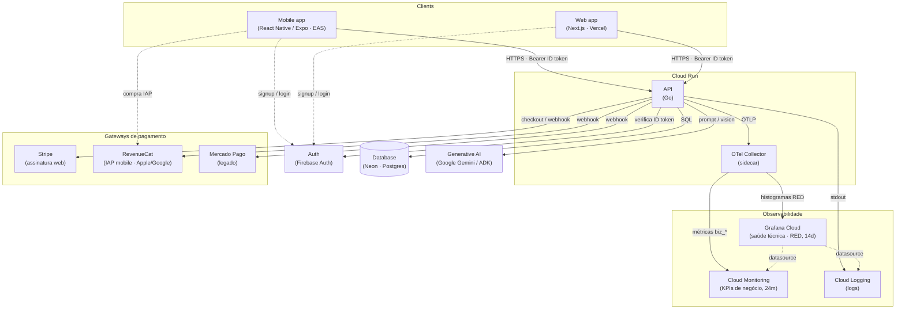

# Visão de arquitetura (C4 — contexto + containers)

> **Documento vivo.** Retrata a topologia **vigente** do produto: quais serviços existem,
> como se conectam e em que provedores rodam. É a foto do "como está hoje", não o histórico
> de decisões — o **porquê** de cada escolha mora nos `ADR`.
>
> **Atualize na mesma edição** que adiciona/remove um serviço ou integração externa
> (ver `_meta/conventions.md` §7 e §10). Ao criar um `ADR` que mude a topologia, atualize o
> diagrama abaixo no mesmo PR.
>
> Nomes de serviços/sistemas em **inglês** (atravessam para o código); provedores entre
> parênteses. Diagrama em **Mermaid `flowchart`** (renderiza no GitHub de forma confiável)
> expressando um C4 nível 1–2.

## Diagrama (container view)

> A pilha de observabilidade (OTel Collector + Grafana Cloud + Cloud Monitoring + Cloud
> Logging) já está em produção (ver `CHANGELOG@api` v1.18.0–v1.20.0); a decisão/justificativa
> ainda não foi formalizada como `ADR` — pendente (ver `RNF-04@context`).

## Containers e integrações (legenda)

| Container / Integração | Papel | Provedor |
|-------------------------|-------|----------|
| **Mobile app** | Cliente do `User` no celular | React Native / Expo (EAS) |
| **Web app** | Cliente do `User` no navegador | Next.js (Vercel) |
| **API** | Núcleo de domínio; fonte da verdade | Go (Cloud Run) |
| **OTel Collector** | Sidecar de telemetria; roteia métricas/traces por destino | Cloud Run |
| **Auth** | Identidade (ID token) | Firebase Auth |
| **Database** | Persistência do domínio | Neon (Postgres) |
| **Generative AI** | `Agent` (chat) e extração de `Statement` (visão computacional) | Google Gemini / ADK |
| **Stripe** | Cobrança de `Subscription` no web | Stripe |
| **RevenueCat** | Cobrança de `Subscription` via IAP no mobile (Apple App Store / Google Play) | RevenueCat |
| **Mercado Pago** | Gateway legado; mantido só para assinantes com `Subscription` anterior à migração | Mercado Pago |
| **Grafana Cloud** | Dashboards de saúde técnica (RED/USE); retenção de 14 dias | Grafana Cloud (free tier) |
| **Cloud Monitoring** | KPIs de negócio (`biz_*`); retenção de 24 meses | Google Cloud Monitoring |
| **Cloud Logging** | Logs estruturados da API | Google Cloud Logging |

> Mantenha a tabela e o diagrama em sincronia — se divergirem, **a tabela vence** (texto sobre
> desenho, `conventions.md` §10).
