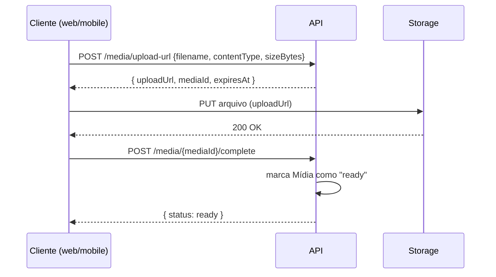

# AYD-001: Upload de mídia (EXEMPLO)

> Exemplo preenchido para mostrar o formato cross-repo. Apague num projeto novo.

## Objetivo
Atender RF-01: usuário envia mídia e acompanha o progresso, em web e mobile.

## Repos afetados e papéis
| Repo | Papel nesta feature | SPEC gerada |
|------|---------------------|-------------|
| api    | Gera URL assinada, persiste metadados, valida tipo/tamanho | SPEC-001@api |
| web    | UI de upload com progresso; consome a API | SPEC-001@web |
| mobile | Upload com retomada; restrições de rede/offline | SPEC-001@mobile |

## Contratos (fonte da verdade)
```
POST /media/upload-url
req:  { filename, contentType, sizeBytes }
res:  { uploadUrl, mediaId, expiresAt }
erros: [ 413 too_large, 415 unsupported_type ]
```

## Modelo de domínio afetado
Entidade `Mídia` (ver GLO): id, owner, status(uploading|ready), metadados.

## Fluxo cross-repo
web/mobile pedem URL assinada → upload direto ao storage → api confirma e marca `ready`.



## Decisões relacionadas
ADR-001 (storage com URL assinada em vez de proxy pela API).

## Fora de escopo / questões em aberto
- [ ] Edição de mídia pós-upload (fora).
