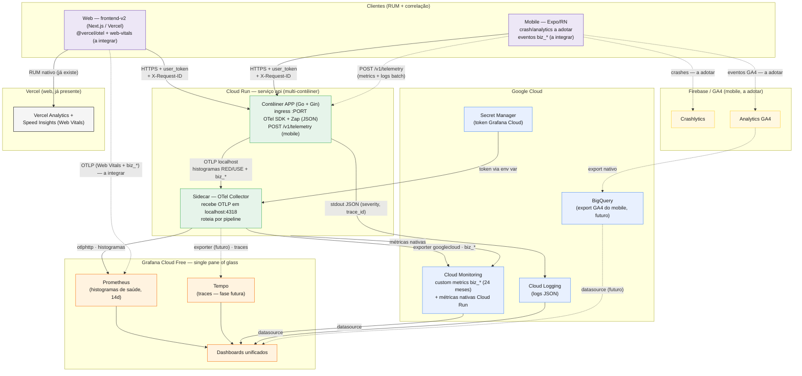
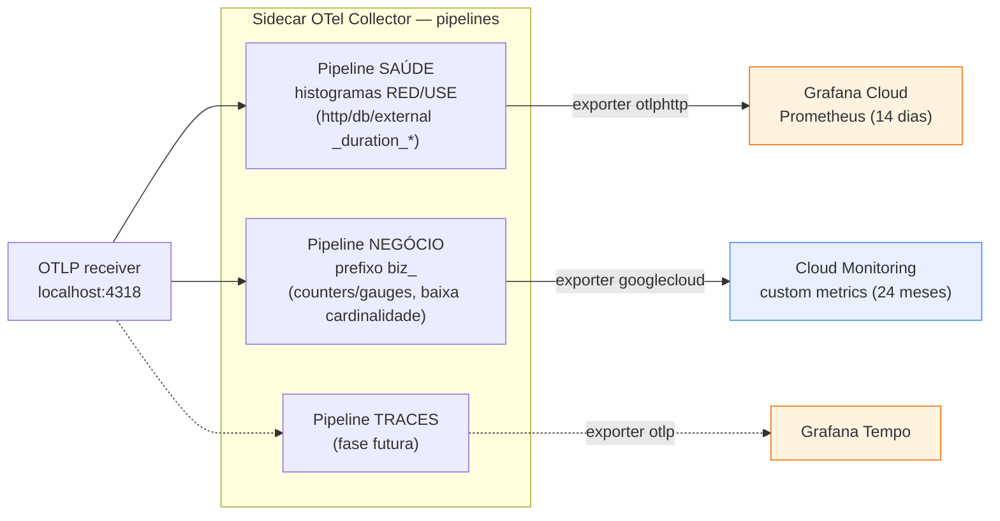

# AYD-002: Monitoramento e observabilidade

> **Nota de formato:** esta feature é uma capacidade de infraestrutura/plataforma
> cross-repo (não um CRUD de domínio voltado ao usuário). Por isso este AYD adapta o
> template padrão: em vez de "contrato REST" e "modelo de domínio", documenta o
> **contrato de telemetria** (convenções de nome de métrica, roteamento por sinal,
> protocolo comum) e o **fluxo de dados de observabilidade** ponta a ponta. A topologia
> vigente (quais serviços existem) já está em `architecture.md` (`ARCH`) — este AYD não a
> duplica; documenta o **desenho e as decisões** que levaram a ela.

## Objetivo

Atender RNF-04 (disponibilidade da API): padronizar **logs** e **métricas** nos três
repos (api, web, mobile) com o menor custo possível, consolidando a visão de saúde
técnica e de KPIs de negócio em dashboards unificados. Sem isso, não há como definir
nem medir uma meta formal de disponibilidade — hoje a API está em produção sem
nenhuma instrumentação de métricas além dos sinais nativos do Cloud Run (que ninguém
observa). Trace ponta a ponta é desejável, mas é explicitamente baixa prioridade
nesta fase.

## Repos afetados e papéis

| Repo | Papel nesta feature | SPEC gerada |
|------|---------------------|-------------|
| api | Fonte da verdade de logs, métricas de saúde (RED/USE) e KPIs de negócio (`biz_*`); roda o sidecar OTel Collector que roteia cada sinal ao destino certo; expõe `POST /v1/telemetry` para receber lotes de telemetria do mobile | nenhuma ainda |
| web | RUM já nativo via Vercel (Web Vitals/Analytics); bridge planejado dos KPIs `biz_*` e do header de correlação via `lib/api/fetcher.ts` | nenhuma ainda |
| mobile | Hoje sem telemetria própria (Firebase só para Auth); ponto de entrada já existe no backend (`POST /v1/telemetry`, shipped em v1.20.0) aguardando o cliente que o consome; adoção de crash/analytics e bridge dos `biz_*` ainda pendente no app | nenhuma ainda |

> `children` fica vazio porque nenhuma `SPEC` formal foi escrita ainda em nenhum repo —
> o que existe hoje (pacote `pkg/metrics`, middleware RED, sidecar, endpoint
> `/v1/telemetry`) foi implementado direto a partir das notas de design originadas no
> repo `api` (ver `CHANGELOG@api` v1.18.0–v1.20.0), sem um processo formal de
> AYD→SPEC. Este documento formaliza retroativamente o desenho já em produção.

## Por que web e mobile entram em `affects`

- **web** já participa hoje de forma nativa e independente (Vercel Speed
  Insights/Analytics coletando Web Vitals sob consentimento LGPD) e está desenhado
  para, na Fase 4 do plano, emitir os mesmos KPIs `biz_*` e o header de correlação
  `X-Request-ID` a partir do `fetcher.ts`. Ainda não tem `@vercel/otel`/`web-vitals`
  integrados.
- **mobile** ainda não tem nenhuma instrumentação própria (sem Crashlytics,
  Performance Monitoring ou GA4 — Firebase é usado só para Auth), mas o **backend já
  shippou um endpoint dedicado para isso** (`POST /v1/telemetry`, PR#209, v1.20.0),
  o que é evidência concreta de que o mobile é parte do desenho, não uma ideia
  futura abstrata — falta apenas o lado cliente.

Por isso `affects: [api, web, mobile]` está correto mesmo com adoção parcial: o
contrato já reserva o papel dos três repos, ainda que web e mobile estejam, na
prática, só parcialmente instrumentados.

## Contrato (fonte da verdade — não pode ser violado por nenhum repo)

Estas são as regras que qualquer repo, ao instrumentar telemetria, deve obedecer.
Mudar qualquer uma destas regras é mudança de contrato e deve ser feita **aqui**,
nunca redefinida localmente em uma SPEC de serviço.

1. **OTLP é o protocolo comum** entre app e coletor. O backend expõe um receiver OTLP
   local (`localhost:4318` HTTP / `4317` gRPC) servido pelo sidecar; nenhum app fala
   diretamente com o backend de observabilidade final (Grafana/Cloud Monitoring) —
   sempre via o **sidecar OTel Collector** do Cloud Run. Web/mobile, que não correm no
   mesmo Cloud Run, chegam à mesma malha por `@vercel/otel` (web, direto a OTLP do
   Grafana Cloud) ou via `POST /v1/telemetry` no backend (mobile, que reencaminha ao
   pipeline OTel).
2. **Prefixo `biz_` é reservado para KPI de negócio.** Qualquer métrica com esse
   prefixo é automaticamente roteada pelo Collector ao Cloud Monitoring (24 meses de
   retenção) em vez do Grafana. Os três repos devem usar exatamente os mesmos nomes
   de métrica `biz_*` do catálogo (§ KPI) — o backend é a fonte canônica de cada KPI;
   web/mobile só complementam com sinais de UX/funil que o backend não enxerga.
3. **Histograma nunca vai para o Cloud Monitoring.** Custa 1 ponto por bucket e
   estoura o free tier rapidamente (orçamento estimado: ~10 rotas × 15 buckets a 60s
   ≈ 6M pontos/mês ≈ ~US$ 89/mês). Toda métrica do tipo `histogram` (latência,
   duração) fica exclusivamente no pipeline de saúde técnica → Grafana Cloud.
4. **Proibido usar `user_id`, ID de entidade (cupom, rota com ID etc.) como label de
   métrica.** Cardinalidade alta estoura tanto os 10k de séries do Grafana Free
   quanto os 150 MiB/mês do Cloud Monitoring. DAU/WAU/MAU e qualquer métrica por
   usuário individual são feitas via eventos/logs (Cloud Logging) ou GA4 — nunca via
   label de métrica OTel. Esta regra é gate de revisão de PR em qualquer repo que
   instrumente uma métrica nova.
5. **KPI de negócio é counter/gauge de baixa cardinalidade com push infrequente
   (1–5 min)**, nunca a cada 10–60s — é o que mantém o catálogo de `biz_*` dentro do
   free tier do Cloud Monitoring com folga (orçamento estimado: ~60 séries × push de
   5 min ≈ 40 MiB/mês, ~26% do free tier de 150 MiB).
6. **Logs ficam no Cloud Logging** (stdout JSON da API, capturado automaticamente
   pelo Cloud Run) e são lidos no Grafana por datasource — nunca duplicados ou
   reprocessados em outro backend de logs.
7. **Correlação cross-repo via `X-Request-ID`.** Web e mobile devem gerar um UUID por
   requisição e enviá-lo no header `X-Request-ID` a partir do ponto único de injeção
   de cada repo (`lib/api/fetcher.ts` no web, `src/lib/api/fetcher.ts` no mobile); a
   API já consome e loga esse header (`pkg/log/middleware.go`@api). Quando tracing
   completo (OTel `traceparent`) entrar, ele substitui/sobrepõe esse header sem exigir
   mudança em nenhum outro ponto do código cliente, porque toda chamada já passa
   pelo wrapper único.
8. **Segredos de observabilidade (token do Grafana Cloud) vivem só no sidecar**, via
   Secret Manager — a aplicação (`api`) nunca tem acesso a esse token.

## Fluxo cross-repo

### Visão geral — ponta a ponta

> Linhas pontilhadas marcam o que ainda **não** está integrado no lado cliente
> (web/mobile) — ver "Fora de escopo / questões em aberto".

### Detalhe — roteamento de sinais no sidecar

Regra central do roteamento (contrato item 2 e 3): separação por **prefixo de nome**
(`biz_*`) e por **tipo** (histogram vs. counter/gauge), em pipelines distintos do
Collector.

## KPI / SLO / fases (síntese do que já foi decidido)

### Saúde técnica (RED/USE) → Grafana Cloud Free, 14 dias

Catálogo essencial: `http_server_requests_total` (rate/error por rota e
`status_class`), `http_server_request_duration_seconds` (histogram, p50/p90/p99),
`http_server_active_requests` (gauge), `db_query_duration_seconds` /
`db_errors_total`, `external_call_duration_seconds` / `external_call_errors_total`
(Firebase, agente de IA, push) e `app_panics_total`. Infra nativa do Cloud Run
(cold starts, instâncias, CPU/mem) complementa via Cloud Monitoring.

**SLOs iniciais:**
- Disponibilidade da API: ≥ 99,5% (taxa de erro 5xx sobre total) — este é o número
  que formaliza a meta hoje pendente em `RNF-04`.
- Latência: p95 < 500 ms em leitura; p95 < 1 s em escrita.
- Erro de jobs internos: < 1%.

### KPIs de negócio (`biz_*`) → Cloud Monitoring, 24 meses

Catálogo essencial mapeado às features do backend: `users_provisioned_total`,
`movements_created_total{type}`, `wallets_created_total`, `invoices_generated_total`
/ `invoices_paid_total`, `subscriptions_active` / `subscription_trials_started_total`
/ `subscription_conversions_total` / `subscription_churn_total`, `mrr_amount`
(gauge, por `plan`/`currency`), `coupons_redeemed_total`, `agent_requests_total` /
`agent_tokens_total` / `agent_request_duration_seconds` / `agent_errors_total`,
`push_sent_total` / `push_failed_total`, `plan_limit_hits_total` (sinal forte de
upsell) e `exports_total` / `account_deletions_total`.

Orçamento de custo: ~60 séries × push de 5 min ≈ ~40 MiB/mês, **~26% do free tier**
de 150 MiB/mês — cabe com folga mesmo dobrando o catálogo.

### Rollout faseado (estado em jun/2026)

| Fase | Entrega | Status |
|---|---|---|
| 0 — Quick wins | Dashboard padrão Cloud Run + datasources Cloud Monitoring/Logging no Grafana | Concluída |
| 1 — Logs padronizados | JSON forçado em produção, `severity` compatível com Cloud Logging, `trace_id`/`span_id`, log de panic estruturado, campos canônicos | Concluída (v1.18.0) |
| 2 — Métricas de saúde + sidecar | `pkg/metrics` (OTel SDK), middleware RED, `/healthz`/`/readyz`, sidecar OTel Collector no Cloud Run | Concluída (v1.18.0–v1.19.0) |
| 3 — Métricas de negócio | KPIs `biz_*` instrumentados nos usecases/bootstrap, roteamento para Cloud Monitoring, dashboard de Negócio | Concluída (v1.19.0) |
| 4 — Web + Mobile | Web: `@vercel/otel`+`web-vitals`→OTLP e `X-Request-ID` no `fetcher.ts`. Mobile: endpoint `POST /v1/telemetry` já shippado (v1.20.0) no backend; falta o cliente mobile adotar crash/analytics e emitir os eventos | **Parcial** — só o lado backend do mobile (endpoint de ingestão) e o RUM nativo do web (Vercel) existem hoje |
| 5 — Alertas & SLOs | SLOs formalizados (acima); alertas no Grafana (5xx, p95, crash-free %, falha de job, queda de MRR) | Pendente |
| 6 — Trace | Tracing OTel → Grafana Tempo, correlação log↔trace | Pendente (baixa prioridade) |

## Decisões relacionadas

- A decisão de arquitetura subjacente — **sidecar OTel Collector no Cloud Run +
  split Grafana Cloud (saúde) / Cloud Monitoring (negócio) / Cloud Logging (logs)** —
  **ainda não foi formalizada como `ADR`** neste repo. Este AYD é, por ora, o único
  registro de design dessa decisão; ela já está implementada e em produção
  (`CHANGELOG@api` v1.18.0–v1.20.0), mas falta o ADR que a torne uma decisão
  arquitetural cross-repo append-only e rastreável junto às demais (ver `RNF-04` em
  `requirements.md`, e a nota equivalente já deixada em `architecture.md`). Criar
  esse ADR é um follow-up — não bloqueia a topologia vigente, que já está correta em
  `ARCH`, mas falta o "porquê" registrado no formato certo.
- `architecture.md` (`ARCH`) já documenta a topologia vigente resultante desta
  decisão (diagrama C4 com OTel Collector, Grafana Cloud, Cloud Monitoring, Cloud
  Logging) — este AYD não duplica esse diagrama; aprofunda o desenho, o contrato de
  nomenclatura e o roteamento por sinal que `ARCH` não detalha.

## Fora de escopo / questões em aberto

- [ ] **ADR formal da decisão de observabilidade** — ainda não escrito (ver seção
      acima). Próximo passo natural após este AYD.
- [ ] **Tracing distribuído (Fase 6)** — explicitamente baixa prioridade; Grafana
      Tempo como destino já está previsto no roteamento do Collector, mas nenhum
      span é emitido hoje.
- [ ] **Adoção de crash/analytics no mobile** — Crashlytics (via
      `@react-native-firebase/*`) ou Sentry React Native; decisão entre as duas
      ainda não tomada. Sem isso, não há crash-free % nem funil de produto no
      mobile.
- [ ] **Adoção de GA4 no mobile** (DAU/MAU, retenção, funil) com export para
      BigQuery e datasource no Grafana — não existe hoje; mobile usa Firebase
      apenas para Auth.
- [ ] **Bridge do web via `@vercel/otel` + `web-vitals`** — pendente; hoje o web só
      tem o RUM nativo da Vercel (Analytics/Speed Insights), sem ponte para o
      Grafana nem emissão de `biz_*`/`X-Request-ID`.
- [ ] **Cliente mobile para `POST /v1/telemetry`** — o endpoint já existe no
      backend (v1.20.0), mas nenhum código no repo mobile o chama ainda.
- [ ] **Alertas e SLOs formais no Grafana** (Fase 5) — os SLOs estão definidos
      acima como meta, mas os alertas ainda não foram configurados.
- [ ] **Cobrança de alerting do Cloud Monitoring** a partir de ~set/2026
      (~US$0,35/métrica referenciada) — mitigação planejada é centralizar alertas
      no Grafana, mas isso depende da Fase 5.
- [ ] **Logs no Loki (Grafana)** vs. permanecer no Cloud Logging — decisão atual é
      permanecer no Cloud Logging (grátis, zero código); revisitar se o volume ou a
      necessidade de correlação log↔trace mudar esse cálculo.
