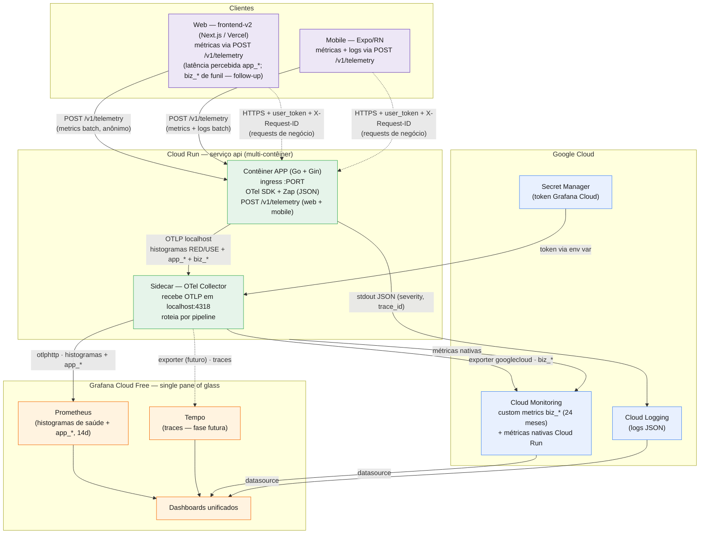
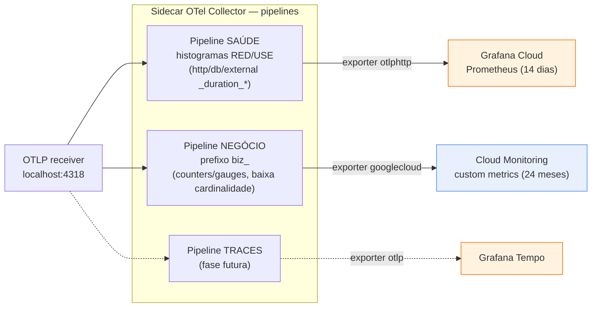

# AYD-002: Monitoramento e observabilidade

> **Nota de formato:** esta feature é uma capacidade de infraestrutura/plataforma
> cross-repo (não um CRUD de domínio voltado ao usuário). Por isso este AYD adapta o
> template padrão: em vez de "contrato REST" e "modelo de domínio", documenta o
> **contrato de telemetria** (convenções de nome de métrica, roteamento por sinal,
> protocolo comum) e o **fluxo de dados de observabilidade** ponta a ponta. A topologia
> vigente (quais serviços existem) já está em `architecture.md` (`ARCH`) — este AYD não a
> duplica; documenta o **desenho e as decisões** que levaram a ela.

## Objetivo

Atender RNF-04 (disponibilidade da API): padronizar **logs** e **métricas** nos três
repos (api, web, mobile) com o menor custo possível, consolidando a visão de saúde
técnica e de KPIs de negócio em dashboards unificados. Sem isso, não há como definir
nem medir uma meta formal de disponibilidade — hoje a API está em produção sem
nenhuma instrumentação de métricas além dos sinais nativos do Cloud Run (que ninguém
observa). Trace ponta a ponta é desejável, mas é explicitamente baixa prioridade
nesta fase.

## Repos afetados e papéis

| Repo | Papel nesta feature | SPEC gerada |
|------|---------------------|-------------|
| api | Fonte da verdade de logs, métricas de saúde (RED/USE) e KPIs de negócio (`biz_*`); roda o sidecar OTel Collector que roteia cada sinal ao destino certo; expõe `POST /v1/telemetry` para receber lotes de telemetria do mobile | nenhuma ainda |
| web | Emite métricas operacionais via `POST /v1/telemetry` (mesmo contrato do mobile) a partir do ponto único `lib/api/fetcher.ts`; hoje instrumenta a latência percebida (`app_http_client_request_duration_seconds`) + header de correlação `X-Request-ID`; KPIs `biz_*` de funil são follow-up | nenhuma ainda |
| mobile | Emite métricas + logs via `POST /v1/telemetry` (endpoint shipped em v1.20.0) a partir de `src/lib/api/fetcher.ts`; Firebase usado só para Auth; bridge dos `biz_*` de funil ainda pendente no app | nenhuma ainda |

> `children` fica vazio porque nenhuma `SPEC` formal foi escrita ainda em nenhum repo —
> o que existe hoje (pacote `pkg/metrics`, middleware RED, sidecar, endpoint
> `/v1/telemetry`) foi implementado direto a partir das notas de design originadas no
> repo `api` (ver `CHANGELOG@api` v1.18.0–v1.20.0), sem um processo formal de
> AYD→SPEC. Este documento formaliza retroativamente o desenho já em produção.

## Por que web e mobile entram em `affects`

- **web** emite telemetria pelo mesmo ponto de ingestão do mobile
  (`POST /v1/telemetry`), a partir do wrapper único `lib/api/fetcher.ts`. Hoje já
  envia a métrica de latência percebida (`app_http_client_request_duration_seconds`)
  e injeta o header de correlação `X-Request-ID`; o restante do catálogo (`biz_*` de
  funil, Web Vitals) é follow-up.
- **mobile** consome o mesmo endpoint (`POST /v1/telemetry`, shipped em PR#209,
  v1.20.0), enviando métricas e logs em lote a partir de `src/lib/api/fetcher.ts`.
  Firebase é usado só para Auth.

Por isso `affects: [api, web, mobile]` está correto: os três repos compartilham **um
único contrato de ingestão** — o backend recebe em `/v1/telemetry` e reencaminha ao
sidecar, e web/mobile só variam no conjunto de sinais que cada um emite. Não há mais
telemetria própria de terceiros no lado cliente (Crashlytics/GA4/Vercel-para-métricas
saíram do desenho); tudo converge para o pipeline OTel via a API.

## Contrato (fonte da verdade — não pode ser violado por nenhum repo)

Estas são as regras que qualquer repo, ao instrumentar telemetria, deve obedecer.
Mudar qualquer uma destas regras é mudança de contrato e deve ser feita **aqui**,
nunca redefinida localmente em uma SPEC de serviço.

1. **OTLP é o protocolo comum** entre app e coletor. O backend expõe um receiver OTLP
   local (`localhost:4318` HTTP / `4317` gRPC) servido pelo sidecar; nenhum app fala
   diretamente com o backend de observabilidade final (Grafana/Cloud Monitoring) —
   sempre via o **sidecar OTel Collector** do Cloud Run. Web e mobile, que não correm no
   mesmo Cloud Run, chegam à mesma malha por um **ponto de ingestão único no backend**
   (`POST /v1/telemetry`), que recebe um lote de métricas/logs e o reencaminha ao
   pipeline OTel. Esse contrato de ingestão é **o mesmo para os dois clientes** — não há
   mais caminho direto do web ao Grafana Cloud (`@vercel/otel` fica reservado apenas para
   os traces da fase futura). Consolidar tudo em `/v1/telemetry` mantém o roteamento por
   sinal, os gates de cardinalidade e o segredo do Grafana num lugar só (o sidecar).
2. **Prefixo `biz_` é reservado para KPI de negócio.** Qualquer métrica com esse
   prefixo é automaticamente roteada pelo Collector ao Cloud Monitoring (24 meses de
   retenção) em vez do Grafana. Os três repos devem usar exatamente os mesmos nomes
   de métrica `biz_*` do catálogo (§ KPI) — o backend é a fonte canônica de cada KPI;
   web/mobile só complementam com sinais de UX/funil que o backend não enxerga.
3. **Histograma nunca vai para o Cloud Monitoring.** Custa 1 ponto por bucket e
   estoura o free tier rapidamente (orçamento estimado: ~10 rotas × 15 buckets a 60s
   ≈ 6M pontos/mês ≈ ~US$ 89/mês). Toda métrica do tipo `histogram` (latência,
   duração) fica exclusivamente no pipeline de saúde técnica → Grafana Cloud.
4. **Proibido usar `user_id`, ID de entidade (cupom, rota com ID etc.) como label de
   métrica.** Cardinalidade alta estoura tanto os 10k de séries do Grafana Free
   quanto os 150 MiB/mês do Cloud Monitoring. DAU/WAU/MAU e qualquer métrica por
   usuário individual são feitas via eventos/logs (Cloud Logging) — nunca via
   label de métrica OTel. Esta regra é gate de revisão de PR em qualquer repo que
   instrumente uma métrica nova.
5. **KPI de negócio é counter/gauge de baixa cardinalidade com push infrequente
   (1–5 min)**, nunca a cada 10–60s — é o que mantém o catálogo de `biz_*` dentro do
   free tier do Cloud Monitoring com folga (orçamento estimado: ~60 séries × push de
   5 min ≈ 40 MiB/mês, ~26% do free tier de 150 MiB).
6. **Logs ficam no Cloud Logging** (stdout JSON da API, capturado automaticamente
   pelo Cloud Run) e são lidos no Grafana por datasource — nunca duplicados ou
   reprocessados em outro backend de logs.
7. **Correlação cross-repo via `X-Request-ID`.** Web e mobile devem gerar um UUID por
   requisição e enviá-lo no header `X-Request-ID` a partir do ponto único de injeção
   de cada repo (`lib/api/fetcher.ts` no web, `src/lib/api/fetcher.ts` no mobile); a
   API já consome e loga esse header (`pkg/log/middleware.go`@api). Quando tracing
   completo (OTel `traceparent`) entrar, ele substitui/sobrepõe esse header sem exigir
   mudança em nenhum outro ponto do código cliente, porque toda chamada já passa
   pelo wrapper único.
8. **Segredos de observabilidade (token do Grafana Cloud) vivem só no sidecar**, via
   Secret Manager — a aplicação (`api`) nunca tem acesso a esse token.

## Fluxo cross-repo

### Visão geral — ponta a ponta

```mermaid
flowchart TB
    subgraph CLI["Clientes"]
        direction TB
        WEB["Web — frontend-v2 (Next.js / Vercel)<br/>métricas via POST /v1/telemetry<br/>(latência percebida app_*; biz_* de funil — follow-up)"]
        MOB["Mobile — Expo/RN<br/>métricas + logs via POST /v1/telemetry"]
    end

    subgraph CR["Cloud Run — serviço api (multi-contêiner)"]
        direction TB
        APP["Contêiner APP (Go + Gin)<br/>ingress :PORT<br/>OTel SDK + Zap (JSON)<br/>POST /v1/telemetry (web + mobile)"]
        COL["Sidecar — OTel Collector<br/>recebe OTLP em localhost:4318<br/>roteia por pipeline"]
        APP -- "OTLP localhost<br/>histogramas RED/USE + app_* + biz_*" --> COL
    end

    subgraph GCP["Google Cloud"]
        direction TB
        LOG["Cloud Logging<br/>(logs JSON)"]
        MON["Cloud Monitoring<br/>custom metrics biz_* (24 meses)<br/>+ métricas nativas Cloud Run"]
        SM["Secret Manager<br/>(token Grafana Cloud)"]
    end

    subgraph GRA["Grafana Cloud Free — single pane of glass"]
        direction TB
        GMET["Prometheus<br/>(histogramas de saúde + app_*, 14d)"]
        GTEMPO["Tempo<br/>(traces — fase futura)"]
        DASH["Dashboards unificados"]
        GMET --> DASH
        GTEMPO --> DASH
    end

    WEB -- "POST /v1/telemetry<br/>(metrics batch, anônimo)" --> APP
    MOB -- "POST /v1/telemetry<br/>(metrics + logs batch)" --> APP
    WEB -. "HTTPS + user_token + X-Request-ID<br/>(requests de negócio)" .-> APP
    MOB -. "HTTPS + user_token + X-Request-ID<br/>(requests de negócio)" .-> APP

    COL -- "otlphttp · histogramas + app_*" --> GMET
    COL -- "exporter googlecloud · biz_*" --> MON
    COL -. "exporter (futuro) · traces" .-> GTEMPO
    SM -- "token via env var" --> COL

    APP -- "stdout JSON (severity, trace_id)" --> LOG
    CR -- "métricas nativas" --> MON

    MON -- "datasource" --> DASH
    LOG -- "datasource" --> DASH

    classDef gcp fill:#E8F0FE,stroke:#4285F4,color:#1a1a1a;
    classDef grafana fill:#FFF3E0,stroke:#F46800,color:#1a1a1a;
    classDef run fill:#E6F4EA,stroke:#34A853,color:#1a1a1a;
    classDef client fill:#EDE7F6,stroke:#673AB7,color:#1a1a1a;

    class LOG,MON,SM gcp;
    class GMET,GTEMPO,DASH grafana;
    class APP,COL run;
    class WEB,MOB client;
```

> Linhas sólidas = fluxo de telemetria vigente: **web e mobile enviam pelo mesmo
> ponto de ingestão** (`POST /v1/telemetry`), que reencaminha ao sidecar. Linhas
> pontilhadas = requests de negócio (correlação por `X-Request-ID`) e o pipeline de
> **traces (fase futura)** — ver "Fora de escopo / questões em aberto".

### Detalhe — roteamento de sinais no sidecar

Regra central do roteamento (contrato item 2 e 3): separação por **prefixo de nome**
(`biz_*`) e por **tipo** (histogram vs. counter/gauge), em pipelines distintos do
Collector.

```mermaid
flowchart LR
    IN["OTLP receiver<br/>localhost:4318"]

    subgraph PIPE["Sidecar OTel Collector — pipelines"]
        direction TB
        P1["Pipeline SAÚDE<br/>histogramas RED/USE<br/>(http/db/external _duration_*)"]
        P2["Pipeline NEGÓCIO<br/>prefixo biz_<br/>(counters/gauges, baixa cardinalidade)"]
        P3["Pipeline TRACES<br/>(fase futura)"]
    end

    IN --> P1
    IN --> P2
    IN -.-> P3

    P1 -- "exporter otlphttp" --> G["Grafana Cloud<br/>Prometheus (14 dias)"]
    P2 -- "exporter googlecloud" --> M["Cloud Monitoring<br/>custom metrics (24 meses)"]
    P3 -. "exporter otlp" .-> T["Grafana Tempo"]

    classDef g fill:#FFF3E0,stroke:#F46800;
    classDef m fill:#E8F0FE,stroke:#4285F4;
    class G,T g;
    class M m;
```

## KPI / SLO / fases (síntese do que já foi decidido)

### Saúde técnica (RED/USE) → Grafana Cloud Free, 14 dias

Catálogo essencial: `http_server_requests_total` (rate/error por rota e
`status_class`), `http_server_request_duration_seconds` (histogram, p50/p90/p99),
`http_server_active_requests` (gauge), `db_query_duration_seconds` /
`db_errors_total`, `external_call_duration_seconds` / `external_call_errors_total`
(Firebase, agente de IA, push) e `app_panics_total`. Infra nativa do Cloud Run
(cold starts, instâncias, CPU/mem) complementa via Cloud Monitoring.

**SLOs iniciais:**
- Disponibilidade da API: ≥ 99,5% (taxa de erro 5xx sobre total) — este é o número
  que formaliza a meta hoje pendente em `RNF-04`.
- Latência: p95 < 500 ms em leitura; p95 < 1 s em escrita.
- Erro de jobs internos: < 1%.

### KPIs de negócio (`biz_*`) → Cloud Monitoring, 24 meses

Catálogo essencial mapeado às features do backend: `users_provisioned_total`,
`movements_created_total{type}`, `wallets_created_total`, `invoices_generated_total`
/ `invoices_paid_total`, `subscriptions_active` / `subscription_trials_started_total`
/ `subscription_conversions_total` / `subscription_churn_total`, `mrr_amount`
(gauge, por `plan`/`currency`), `coupons_redeemed_total`, `agent_requests_total` /
`agent_tokens_total` / `agent_request_duration_seconds` / `agent_errors_total`,
`push_sent_total` / `push_failed_total`, `plan_limit_hits_total` (sinal forte de
upsell) e `exports_total` / `account_deletions_total`.

Orçamento de custo: ~60 séries × push de 5 min ≈ ~40 MiB/mês, **~26% do free tier**
de 150 MiB/mês — cabe com folga mesmo dobrando o catálogo.

### Rollout faseado (estado em jun/2026)

| Fase | Entrega | Status |
|---|---|---|
| 0 — Quick wins | Dashboard padrão Cloud Run + datasources Cloud Monitoring/Logging no Grafana | Concluída |
| 1 — Logs padronizados | JSON forçado em produção, `severity` compatível com Cloud Logging, `trace_id`/`span_id`, log de panic estruturado, campos canônicos | Concluída (v1.18.0) |
| 2 — Métricas de saúde + sidecar | `pkg/metrics` (OTel SDK), middleware RED, `/healthz`/`/readyz`, sidecar OTel Collector no Cloud Run | Concluída (v1.18.0–v1.19.0) |
| 3 — Métricas de negócio | KPIs `biz_*` instrumentados nos usecases/bootstrap, roteamento para Cloud Monitoring, dashboard de Negócio | Concluída (v1.19.0) |
| 4 — Web + Mobile | Contrato de ingestão único (`POST /v1/telemetry`) para os dois clientes. Web: métrica de latência percebida (`app_http_client_request_duration_seconds`) + `X-Request-ID` no `fetcher.ts`. Mobile: endpoint shippado (v1.20.0), cliente enviando métricas/logs | **Parcial** — web enviando latência percebida e mobile consumindo o endpoint; catálogo `biz_*`/UX de cada cliente é follow-up |
| 5 — Alertas & SLOs | SLOs formalizados (acima); alertas no Grafana (5xx, p95, crash-free %, falha de job, queda de MRR) | Pendente |
| 6 — Trace | Tracing OTel → Grafana Tempo, correlação log↔trace | Pendente (baixa prioridade) |

## Decisões relacionadas

- A decisão de arquitetura subjacente — **sidecar OTel Collector no Cloud Run +
  split Grafana Cloud (saúde) / Cloud Monitoring (negócio) / Cloud Logging (logs)** —
  **ainda não foi formalizada como `ADR`** neste repo. Este AYD é, por ora, o único
  registro de design dessa decisão; ela já está implementada e em produção
  (`CHANGELOG@api` v1.18.0–v1.20.0), mas falta o ADR que a torne uma decisão
  arquitetural cross-repo append-only e rastreável junto às demais (ver `RNF-04` em
  `requirements.md`, e a nota equivalente já deixada em `architecture.md`). Criar
  esse ADR é um follow-up — não bloqueia a topologia vigente, que já está correta em
  `ARCH`, mas falta o "porquê" registrado no formato certo.
- `architecture.md` (`ARCH`) já documenta a topologia vigente resultante desta
  decisão (diagrama C4 com OTel Collector, Grafana Cloud, Cloud Monitoring, Cloud
  Logging) — este AYD não duplica esse diagrama; aprofunda o desenho, o contrato de
  nomenclatura e o roteamento por sinal que `ARCH` não detalha.

## Fora de escopo / questões em aberto

- [ ] **ADR formal da decisão de observabilidade** — ainda não escrito (ver seção
      acima). Próximo passo natural após este AYD.
- [ ] **Tracing distribuído (Fase 6)** — explicitamente baixa prioridade, mas a
      **preparação é mantida**: Grafana Tempo já está previsto no roteamento do
      Collector, o `@vercel/otel` no web e o `X-Request-ID` no `fetcher.ts` de cada
      cliente já reservam o ponto único onde o `traceparent` entra sem mudar o código
      cliente. Nenhum span é emitido hoje.
- [ ] **Catálogo `biz_*`/UX por cliente** — web e mobile hoje só emitem sinais
      operacionais (latência percebida, métricas/logs). Os KPIs de funil e Web Vitals
      via `/v1/telemetry` ainda não foram instrumentados.
- [ ] **Alertas e SLOs formais no Grafana** (Fase 5) — os SLOs estão definidos
      acima como meta, mas os alertas ainda não foram configurados.
- [ ] **Cobrança de alerting do Cloud Monitoring** a partir de ~set/2026
      (~US$0,35/métrica referenciada) — mitigação planejada é centralizar alertas
      no Grafana, mas isso depende da Fase 5.
- [ ] **Logs no Loki (Grafana)** vs. permanecer no Cloud Logging — decisão atual é
      permanecer no Cloud Logging (grátis, zero código); revisitar se o volume ou a
      necessidade de correlação log↔trace mudar esse cálculo.
