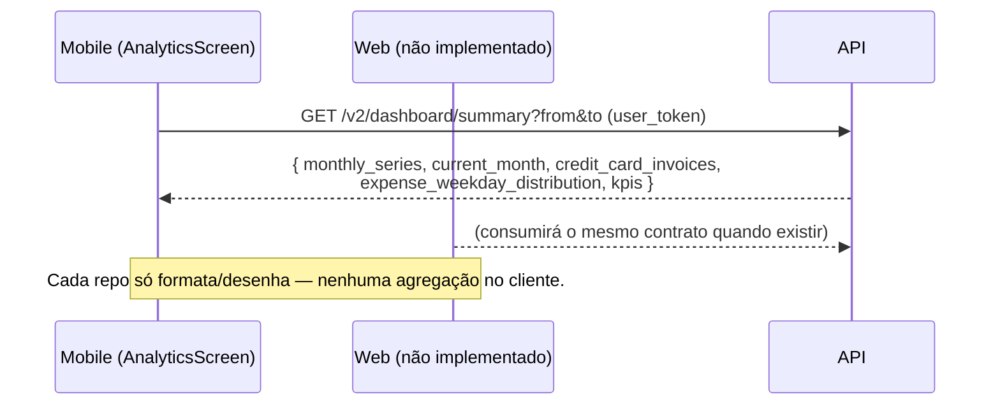

# AYD-003: Análises financeiras (visão ao longo do tempo)

> **Nota de status:** api e mobile já implementam esta feature (PRs abertos
> `personal-finance#212` e `personal-finance-mobile#35`), agora formalizados em
> `SPEC-002@api` e `SPEC-002@mobile`. O **web** continua sem implementação: nem tela, nem
> hook, nem chamada ao endpoint — permanece em `affects` porque consome o mesmo contrato
> quando for construído, mas ainda não tem SPEC.

## Objetivo

A Dashboard mostra só o mês corrente. Esta feature adiciona uma tela de **Análises** que dá
ao usuário uma visão financeira **ao longo do tempo**, a partir de um único endpoint
agregador no backend:

1. **Renda vs Despesa** — série mensal (barras pareadas) ao longo do período.
2. **Orçado vs Realizado** — comparativo do mês selecionado (reusa `Estimate`).
3. **Faturas de cartão** — total de `Invoice` por mês, empilhado por `CreditCard`.
4. **Despesas por dia da semana** — distribuição percentual da **quantidade** de `Movement`s
   de despesa por dia da semana (ex.: "46% das compras acontecem na sexta").
5. **KPIs** — receita e despesa totais do período.

"Realizado" = `Movement`s **pagos** (mesma semântica do `Balance`), com uma exceção
deliberada na distribuição por dia da semana (§ Decisões, #7). Despesas mantêm sinal
**negativo** em todo o fluxo, nos três repos.

## Repos afetados e papéis

| Repo | Papel nesta feature | Estado | SPEC |
|------|---------------------|--------|------|
| api | Agrega `Movement`s, `Estimate`s e `Invoice`s existentes (sem nova tabela/migração) num único endpoint por período; isolamento por `user_id` | Implementado | `SPEC-002@api` |
| mobile | Consome o contrato; tela "Análises" acessada pelo menu **Mais**; só formata/desenha o que a api devolve, sem agregação no cliente | Implementado | `SPEC-002@mobile` |
| web | Consome o **mesmo contrato**; tela equivalente como item de primeiro nível na sidebar | **Não implementado** | — |

## Contrato (fonte da verdade)

```
GET /v2/dashboard/summary?from=YYYY-MM-DD&to=YYYY-MM-DD
Auth: Firebase (header user_token)
```

| Parâmetro | Tipo | Descrição |
|---|---|---|
| `from` | date (`2006-01-02`) | Início do período (inclusivo) |
| `to` | date (`2006-01-02`) | Fim do período; o **mês de `to`** é o "mês selecionado" do orçado×realizado |

Response (`200`):
```json
{
  "monthly_series": [
    { "month": 1, "year": 2026, "income": 5000, "expense": -3200, "net": 1800 }
  ],
  "current_month": {
    "month": 6, "year": 2026,
    "budget": {
      "income":  { "budgeted": 5000, "realized": 4800 },
      "expense": { "budgeted": -3000, "realized": -3200 }
    }
  },
  "credit_card_invoices": {
    "cards": [
      { "credit_card_id": "0f1c…", "name": "Nubank" },
      { "credit_card_id": "7ab2…", "name": "Itaú" }
    ],
    "series": [
      {
        "month": 6, "year": 2026, "total": -2100,
        "by_card": [
          { "credit_card_id": "0f1c…", "amount": -1400 },
          { "credit_card_id": "7ab2…", "amount": -700 }
        ]
      }
    ]
  },
  "expense_weekday_distribution": [
    { "weekday": 0, "count": 3,  "percentage": 0.06 },
    { "weekday": 5, "count": 23, "percentage": 0.46 }
  ],
  "kpis": { "total_income": 30000, "total_expense": -19200 }
}
```

Semântica:

| Campo | Regra |
|---|---|
| `monthly_series[]` | 1 entrada por mês do span (meses sem `Movement` vêm zerados → eixo contínuo). `income`/`expense` = soma de pagos; `net = income + expense` |
| `current_month.budget` | mês de `to`. `budgeted` vem do `Estimate`; `realized` = pagos do mês (reusa lógica teto/piso do `Balance`) |
| `credit_card_invoices.cards[]` | Todo `CreditCard` com pelo menos uma `Invoice` no período. Ordenado por `name`; é a legenda/ordem de empilhamento canônica |
| `credit_card_invoices.series[]` | 1 entrada por mês do span (mesmo eixo de `monthly_series`, meses sem fatura zerados). Uma `Invoice` cai no mês do seu **`due_date`** (§ Decisões, #8). `by_card[]` traz **todos** os cartões de `cards[]`, com `0` onde não houve fatura, para o empilhamento não “pular” cor. `total` = soma de `by_card[].amount` |
| `expense_weekday_distribution[]` | Sempre **7 entradas**, `weekday` 0=domingo … 6=sábado (mesma numeração de `time.Weekday`). `count` = quantidade de `Movement`s de despesa; `percentage` = `count / total de despesas do período` (fração 0–1, **0** quando não há despesa) |
| `kpis` | Só `total_income` e `total_expense` do período |
| sinais | despesas e faturas sempre **negativas** |

Erros: `from`/`to` em formato inválido ou período inválido (`period.Validate()`) →
`400` (`WrapInvalidInput`); falha de repositório → `500`.

Este mesmo contrato serve **api → mobile** e **api → web**; nenhum repo redefine campo ou
semântica localmente (regra de linkagem, `conventions.md` §5).

### Removido nesta revisão

`kpis` deixou de expor `avg_monthly_income`, `avg_monthly_expense`, `period_net` e
`savings_rate` — os quatro cartões de KPI (receita média, despesa média, saldo do período,
taxa de poupança) saíram da tela por decisão de produto. São **breaking changes** no payload;
como a feature ainda não chegou a produção em nenhum cliente, não há versionamento a fazer.

## Fluxo cross-repo



## Consumidores

### Mobile (implementado)

```
AnalyticsScreen
   └─ useDashboardSummary(from, to)          (src/hooks/use-dashboard.ts)
        └─ fetchDashboardSummary             (src/lib/api/dashboard.ts → fetcher)
             └─ GET /v2/dashboard/summary
   ├─ FinancialKpiCards         ← kpis (receita total, despesa total)
   ├─ IncomeExpenseBarChart     ← monthly_series
   ├─ BudgetVsActualChart       ← current_month.budget
   ├─ CreditCardInvoicesChart   ← credit_card_invoices  (barras empilhadas por cartão)
   └─ ExpenseWeekdayChart       ← expense_weekday_distribution  (barras, eixo em %)
```

- Acesso: menu **Mais** (não vira nova aba — a tab bar já tem 5 itens + FAB).
- Período: 1º de janeiro → fim do mês selecionado (via `MonthSelector` + contexto `useMonth`).
- Cache: React Query (`staleTime` 5 min, `gc` 10 min); chave inclui `from`/`to`.
- Estados: skeletons no loading; empty-state por componente.
- Gráficos: svg + d3-scale (sem dependência nova).
- **Eixo Y:** todo gráfico de barras em dinheiro (`IncomeExpenseBarChart`,
  `BudgetVsActualChart`, `CreditCardInvoicesChart`) desenha eixo vertical com ticks
  rotulados em **R$**, formatados pelo locale do usuário (§ Decisões, #9).
  `ExpenseWeekdayChart` é o único com eixo em **%**.

### Web (não implementado)

Quando for construído, consome o mesmo contrato: item de primeiro nível na sidebar
(`components/dashboard/dashboard-sidebar.tsx`), SWR (`lib/api/cache-keys.ts`) e `recharts`
(já é dependência do repo). Precisa de `SPEC-002@web` antes de implementar.

## Decisões de design

| # | Decisão | Por quê |
|---|---|---|
| 1 | Endpoint agregador no backend | Menos payload e zero lógica de agregação duplicada nos clientes |
| 2 | Realizado = `Movement`s pagos | Consistência com a semântica de "realizado" do `Balance` |
| 3 | Mobile acessa via menu **Mais** | Tab bar já tem 5 itens + FAB |
| 4 | Web ganharia item de sidebar de primeiro nível | Sem a restrição de espaço do mobile |
| 5 | Realizado do orçamento filtrado ao mês de `to` | Período é multi-mês (≠ `Balance`); evita somar o período inteiro |
| 6 | Cada cliente usa sua lib de gráfico já existente (mobile: svg+d3-scale; web: recharts) | O contrato é o mesmo; a renderização não precisa ser |
| 7 | Distribuição por dia da semana conta **todas** as despesas do período (pagas **e** pendentes), excluindo `internal_transfer` | Mede **comportamento de compra**, não caixa realizado. Compra no cartão fica `is_paid: false` até a `Invoice` ser paga — filtrar por pago apagaria justamente as compras de cartão e distorceria o gráfico. `InternalTransfer` é movimento entre `Wallet`s do próprio usuário, não compra (ver GLO) |
| 8 | `Invoice` entra no mês do seu `due_date` | É a convenção que a api já usa (`InvoiceRepository.FindByMonth` filtra por `due_date`); "fatura de agosto" = a que vence em agosto |
| 9 | Eixo Y rotulado em R$ nos gráficos de dinheiro | Sem escala, a barra só dá ordem relativa; o usuário pediu leitura de valor absoluto direto do gráfico |
| 10 | `by_card[]` sempre completo (com zeros) | Empilhamento estável: cor/ordem do cartão não muda de mês para mês |

## Decisões relacionadas

Nenhum `ADR`/`PDR` aplicável — não há mudança de topologia (nenhum serviço/integração novo)
nem decisão de produto formal registrada.

## Fora de escopo / questões em aberto

- [ ] **SPEC-002@web + implementação web** — o web segue sem nenhuma parte desta feature.
- [ ] **Top categorias no tempo, fixo×variável, projeção de fluxo de caixa** — extensões
      futuras do mesmo endpoint/contrato, fora do MVP.
- [ ] **`GetExpenseMovements` inclui `internal_transfer`** — o helper de domínio da api filtra
      só por `amount < 0`, então transferências internas entram em `monthly_series` e nos KPIs,
      contrariando o GLO. A distribuição por dia da semana já as exclui (#7); alinhar o resto
      é uma correção à parte, fora deste AYD.
