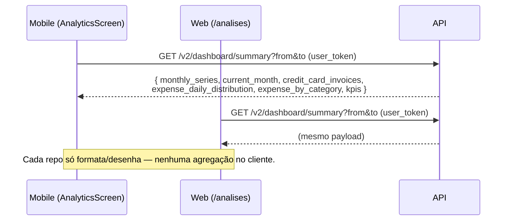

# AYD-003: Análises financeiras (visão ao longo do tempo)

> **Nota de status:** os **três** repos implementam a feature. api e mobile
> entregaram em `personal-finance#212` / `personal-finance-mobile#35`
> (`SPEC-002@api`, `SPEC-002@mobile`); o **web** ganhou `SPEC-002@web` e a página `/analises`
> na branch `claude/spec-ayd-analise-web-22qtwa`@web — implementada com paridade de
> visualizações e ordem com o mobile, **ainda não mergeada em `develop`**.
>
> **Recorte unificado:** os agregados de dinheiro leem o recorte canônico de `AYD-005`, numa
> implementação de servidor só; ver
> [§ Recorte de "realizado"](#recorte-de-realizado).

## Objetivo

A Dashboard mostra só o mês corrente. Esta feature adiciona uma tela de **Análises** que dá
ao usuário uma visão financeira **ao longo do tempo**, a partir de um único endpoint
agregador no backend: **cinco visualizações + uma faixa de KPIs**, nesta ordem (a mesma nos
dois clientes, ver `SPEC-002@mobile` e `SPEC-002@web`):

| # | Visualização | Campo do payload |
|---|---|---|
| — | **KPIs** — receita e despesa totais do período (faixa no topo, não é gráfico) | `kpis` |
| 1 | **Receitas vs Despesas** — série mensal (barras pareadas) ao longo do período | `monthly_series` |
| 2 | **Despesas por categoria** — total pago no período por `Category`, da maior para a menor despesa | `expense_by_category` |
| 3 | **Orçado vs Realizado** — comparativo do mês selecionado (reusa `Estimate`) | `current_month.budget` |
| 4 | **Cartões de crédito** — total de `Invoice` por mês, empilhado por `CreditCard`, na cor de cada cartão | `credit_card_invoices` |
| 5 | **Mapa de calor de gastos por dia** — calendário em que cada dia do período recebe a intensidade do seu gasto, alternável entre **valor** e **quantidade**. A soma de cada coluna do calendário é a leitura por dia da semana (ex.: "46% das compras acontecem na sexta"), que antes era um gráfico próprio | `expense_daily_distribution` |

"Realizado" = `Movement`s **pagos** (mesma semântica do `Balance`), com uma exceção
deliberada no mapa de calor diário (§ Decisões, #7). Despesas mantêm sinal
**negativo** em todo o fluxo, nos três repos.

> **Ver AYD-005.** Ele detalha o *recorte* dessa mesma definição (quais `type_payment`
> entram e saem) e expõe o campo `realized_paid`, que é exatamente o que
> `current_month.budget.realized` precisa aqui. As duas features devem ler a mesma
> implementação no servidor, não duas parecidas — e desde 22/ago/2026 **leem**, ver
> [§ Recorte de "realizado"](#recorte-de-realizado).

## Repos afetados e papéis

| Repo | Papel nesta feature | Estado | SPEC |
|------|---------------------|--------|------|
| api | Agrega `Movement`s, `Estimate`s e `Invoice`s existentes (sem nova tabela/migração) num único endpoint por período; isolamento por `user_id` | Implementado | `SPEC-002@api` |
| mobile | Consome o contrato; tela "Análises" acessada pelo menu **Mais**; só formata/desenha o que a api devolve, sem agregação no cliente | Implementado | `SPEC-002@mobile` |
| web | Consome o **mesmo contrato**; página `/analises` como item de primeiro nível na sidebar; só formata/desenha, sem agregação no cliente | Implementado em branch (`claude/spec-ayd-analise-web-22qtwa`), fora de `develop` | `SPEC-002@web` |

## Contrato (fonte da verdade)

```
GET /v2/dashboard/summary?from=YYYY-MM-DD&to=YYYY-MM-DD
Auth: Firebase (header user_token)
```

| Parâmetro | Tipo | Descrição |
|---|---|---|
| `from` | date (`2006-01-02`) | Início do período (inclusivo) |
| `to` | date (`2006-01-02`) | Fim do período; o **mês de `to`** é o "mês selecionado" do orçado×realizado |

Response (`200`):
```json
{
  "monthly_series": [
    { "month": 1, "year": 2026, "income": 5000, "expense": -3200, "net": 1800 }
  ],
  "current_month": {
    "month": 6, "year": 2026,
    "budget": {
      "income":  { "budgeted": 5000, "realized": 4800 },
      "expense": { "budgeted": -3000, "realized": -3200 }
    }
  },
  "credit_card_invoices": {
    "cards": [
      { "credit_card_id": "0f1c…", "name": "Nubank", "color": "#820ad1" },
      { "credit_card_id": "7ab2…", "name": "Itaú",   "color": "" }
    ],
    "series": [
      {
        "month": 6, "year": 2026, "total": -2100,
        "by_card": [
          { "credit_card_id": "0f1c…", "amount": -1400 },
          { "credit_card_id": "7ab2…", "amount": -700 }
        ]
      }
    ]
  },
  "expense_daily_distribution": [
    { "date": "2026-06-05", "count": 3, "total": -412.50 },
    { "date": "2026-06-06", "count": 0, "total": 0 }
  ],
  "expense_weekday_distribution": [
    { "weekday": 0, "count": 3,  "percentage": 0.06 },
    { "weekday": 5, "count": 23, "percentage": 0.46 }
  ],
  "expense_by_category": [
    { "category_id": "9c3a…", "name": "Alimentação", "color": "#f97316", "total": -8400 },
    { "category_id": "1e7b…", "name": "Transporte",  "color": "",        "total": -4200 }
  ],
  "kpis": { "total_income": 30000, "total_expense": -19200 }
}
```

Semântica:

| Campo | Regra |
|---|---|
| `monthly_series[]` | 1 entrada por mês do span (meses sem `Movement` vêm zerados → eixo contínuo). `income`/`expense` = soma de pagos; `net = income + expense` |
| `current_month.budget` | mês de `to`. `budgeted` vem do `Estimate`; `realized` = pagos do mês (reusa lógica teto/piso do `Balance`) |
| `credit_card_invoices.cards[]` | Todo `CreditCard` com pelo menos uma `Invoice` no período. Ordenado por `name`; é a legenda/ordem de empilhamento canônica. `color` é a cor do próprio `CreditCard` (`#RRGGBB`) e vem **vazia** quando o usuário não escolheu nenhuma — o cliente aplica o fallback (§ Decisões, #11) |
| `credit_card_invoices.series[]` | 1 entrada por mês do span (mesmo eixo de `monthly_series`, meses sem fatura zerados). Uma `Invoice` cai no mês do seu **`due_date`** (§ Decisões, #8). `by_card[]` traz **todos** os cartões de `cards[]`, com `0` onde não houve fatura, para o empilhamento não “pular” cor. `total` = soma de `by_card[].amount` |
| `expense_daily_distribution[]` | Uma entrada **por dia do span**, inclusive os dias sem gasto (`count: 0`, `total: 0`) — mesmo motivo do zero-fill de `by_card` (decisão #10): o calendário é um eixo estável, e é o zero-fill que faz de "dia sem gasto" um dado do servidor em vez de uma inferência do cliente. `date` no formato `2006-01-02`, em ordem crescente. `count` = quantidade de `Movement`s de despesa; `total` = soma dos valores, sempre **negativo** (`0` no dia sem gasto). Recorte **comportamental** (decisão #7): pagas **e** pendentes, pelo dia da própria compra, e **com `Category`** — sem ela não há como classificar receita×despesa. **Fora dos invariantes de conciliação** |
| `expense_weekday_distribution[]` | **Deprecado** (decisão #15) — mantido no payload por um ciclo de release para os clientes já publicados. É a marginal por coluna de `expense_daily_distribution`; cliente novo deriva dela e não lê este campo. Sempre **7 entradas**, `weekday` 0=domingo … 6=sábado (mesma numeração de `time.Weekday`). `count` = quantidade de `Movement`s de despesa; `percentage` = `count / total de despesas do período` (fração 0–1, **0** quando não há despesa) |
| `expense_by_category[]` | Uma entrada por `Category` com despesa **paga** no período (soma de `Movement`s, exclui `internal_transfer`). Ordenado da maior despesa para a menor (em módulo). Categoria sem despesa paga no período **não aparece** — ao contrário de `by_card`, não há eixo de meses para manter estável, então não há zero-fill. `color` é a cor da própria `Category` e pode vir vazia (mesma regra do cartão, decisão #11) |
| `kpis` | Só `total_income` e `total_expense` do período |
| sinais | despesas e faturas sempre **negativas** |

Erros: `from`/`to` em formato inválido ou período inválido (`period.Validate()`) →
`400` (`WrapInvalidInput`); falha de repositório → `500`.

Este mesmo contrato serve **api → mobile** e **api → web**; nenhum repo redefine campo ou
semântica localmente (regra de linkagem, `conventions.md` §5).

### Recorte de "realizado"

A tabela acima diz *de onde* cada número vem; esta seção diz **quais `Movement`s** cada um
soma. Até 22/ago/2026 essa definição não existia no doc, e o resultado eram **três recortes
diferentes dentro da mesma resposta** — ver § Histórico, ao final da seção.

**Regra vigente (decidida pelo owner em 22/ago/2026):** todos os agregados de dinheiro desta
tela usam o **recorte canônico de `AYD-005`**, lendo a mesma implementação de servidor, não
uma parecida.

| Situação | Entra? | Onde conta |
|---|---|---|
| `Movement` avulso do período | sim | mês da própria data |
| Compra no `CreditCard` | sim, via itens da `Invoice` | mês do `due_date` da fatura |
| `invoice_remainder` | sim, via itens da `Invoice` | mês do `due_date` da fatura que o recebe |
| `invoice_payment` | **não** | — (as compras já entram itemizadas; contá-lo duplica o cartão) |
| `internal_transfer` | **não** | — (`GLO`: não entra no resultado do período) |
| `Movement` na `Category` fixa de transferência interna | **não** | — (pega as linhas antigas, gravadas antes do `type_payment` existir) |

Três regras derivam daí:

- **Mês de um item de fatura = mês do `due_date` da `Invoice`**, não o da compra. É a mesma
  convenção do gráfico de cartões (decisão #8) e a que `GET /v2/estimate/summary` já usa ao
  selecionar as faturas do mês. É o que garante `sum(monthly_series) == kpis` e
  `current_month.budget.realized == realized_paid` — atribuir pela data da compra jogaria
  itens para fora do span, que é selecionado por `due_date`. *(Nota: a linha "no mês da
  compra" em `AYD-005` § Recorte canônico descreve a intenção, não o que o servidor faz;
  registrado como pendência lá.)*
- **Receita × despesa sai da flag `is_income` da `Category`, nunca do sinal** — também parte
  do recorte canônico. Um estorno em categoria de despesa reduz a despesa em vez de virar
  receita. `Movement` sem `Category` fica **fora de todos os agregados de dinheiro**: não há
  como classificá-lo nem agrupá-lo, e é o mesmo corte de `aggregateRealized`, no summary de
  planejamentos. O `GLO` já diz que `Category` é obrigatória em todo `Movement`.
- **`current_month.budget.realized` é soma pura**, sem o teto/piso do `Balance` legacy
  (`getBalanceSum`). Orçado 5000 com 4800 realizado passa a mostrar **4800**, não 5000.

`expense_daily_distribution` (e a marginal deprecada `expense_weekday_distribution`, derivada
dela) segue com pagas **e** pendentes (decisão #7), sobre esse mesmo conjunto — é o que
finalmente entrega as compras no cartão que a decisão prometia —, mas pelo **dia da própria
compra**, não pelo vencimento, e sem o `invoice_remainder`, que é saldo empurrado para a
fatura seguinte e não uma compra.

É justamente por isso que o mapa de calor existe: atribuir a compra ao `due_date` jogaria a
fatura inteira numa célula só, no dia do vencimento, e apagaria o comportamento que o gráfico
se propõe a medir. O preço é que **o total do mapa de calor não fecha com `kpis.total_expense`**
— ver § Invariantes de conciliação, e a consequência de apresentação na § Regras de
apresentação do mapa de calor.

`credit_card_invoices` **não muda**: continua somando `Invoice.Amount` por `due_date`. É o
único bloco que fala de fatura.

#### Invariantes de conciliação

Os blocos não são listas independentes: **todos os agregados de dinheiro saem da mesma base**
(recorte canônico ∩ pagas ∩ com `Category`), sem nenhum filtro extra por bloco. O contrato
garante, e a api testa:

```
sum(expense_by_category[].total) == kpis.total_expense == sum(monthly_series[].expense)
sum(monthly_series[].income)     == kpis.total_income
monthly_series[mês de `to`]      == current_month.budget.{income,expense}.realized
monthly_series[].net             == income + expense
```

Dois blocos **não** entram nessas igualdades, de propósito:

- `expense_daily_distribution` mede **comportamento de compra**, não caixa: é a única exceção
  que aceita pendente e a única que atribui o item de fatura ao **dia da compra**, não ao
  `due_date` (decisão #7). Vale para os dois números do bloco — `count` e `total`. Logo
  `sum(expense_daily_distribution[].total) ≠ kpis.total_expense`, **de propósito**: a
  diferença é a compra de cartão contada em dias diferentes pelos dois recortes.
  `expense_weekday_distribution`, enquanto existir, é marginal deste bloco e herda a mesma
  ressalva.
- `credit_card_invoices` é outra lente: soma `Invoice.Amount` por `due_date`, o que inclui
  compras ainda não pagas. Uma fatura em aberto aparece aqui e **não** nos agregados de
  dinheiro — só entra quando é paga.

**Consequência para o cliente:** uma `Category` de despesa pode vir com `total` **positivo**
(estorno maior que o gasto no período). Ela permanece no array porque é ela que faz a soma
fechar — omiti-la quebraria o primeiro invariante. Quem desenha barras deve filtrar por
`total < 0` **antes** de tirar o módulo; aplicar `Math.abs` primeiro transforma o estorno numa
barra de gasto e infla o total da tela.

O invariante vale no **payload** e não tem como valer na **tela**: a categoria positiva
simplesmente não tem barra de despesa a desenhar. Por isso o total no cabeçalho do card de
categorias sai de `kpis.total_expense`, **nunca** da soma das barras visíveis, e quando as
duas coisas não fecham o cliente **sinaliza a diferença** (categorias omitidas por terem
fechado positivas) em vez de escondê-la. O `hiddenCount` do agrupamento "outras" não cobre
este caso.

Categoria de despesa fechando positiva por dado ruim — e não por estorno legítimo — é a
categoria de fallback do import, tratada em `AYD-006@context`.

**A não-duplicação é garantia do recorte, não da query.** Um `Movement` que pertence a uma
`Invoice` é recusado na lista avulsa porque entra pelos itens dela. Antes, o que segurava o
double-count era um `type_payment NOT IN (credit_card, invoice_remainder)` dentro de
`MovementRepository.FindByPeriod`@api — escrito para o `Agent` (`personal-finance#167`,
mar/2026), herdado sem intenção e sem registro em documento nenhum.

**Impacto para o usuário:** os números mudam. Quem usa cartão passa a ver a despesa
itemizada nas categorias reais em vez de um bloco "Cartão de crédito", e o "Realizado" do
orçamento deixa de ser inflado pelo piso do orçado. Vale nota de release.

### Removido do payload

**Deprecado em 15/set/2026:** `expense_weekday_distribution`, substituído por
`expense_daily_distribution`, do qual é a marginal por coluna. O campo **continua no payload**
por um ciclo de release (decisão #15) porque api e mobile já estão em produção. Cliente novo
não o lê: deriva a leitura por dia da semana das colunas do calendário.

**Removido em 25/ago/2026:** `kpis` deixou de expor `avg_monthly_income`, `avg_monthly_expense`, `period_net` e
`savings_rate` — os quatro cartões de KPI (receita média, despesa média, saldo do período,
taxa de poupança) saíram da tela por decisão de produto. São **breaking changes** no payload;
como a feature ainda não chegou a produção em nenhum cliente, não há versionamento a fazer.

## Fluxo cross-repo



## Consumidores

### Mobile (implementado)

```
AnalyticsScreen
   └─ useDashboardSummary(from, to)          (src/hooks/use-dashboard.ts)
        └─ fetchDashboardSummary             (src/lib/api/dashboard.ts → fetcher)
             └─ GET /v2/dashboard/summary
   ├─ FinancialKpiCards         ← kpis (receita total, despesa total)
   ├─ IncomeExpenseBarChart     ← monthly_series
   ├─ BudgetVsActualChart       ← current_month.budget
   ├─ CreditCardInvoicesChart   ← credit_card_invoices  (empilhado, na cor de cada cartão)
   ├─ ExpenseDailyHeatmap       ← expense_daily_distribution  (calendário, chave Valor/Quantidade)
   └─ ExpenseByCategoryChart    ← expense_by_category  (uma barra por categoria, na cor de cada uma)
```

- Acesso: menu **Mais** (não vira nova aba — a tab bar já tem 5 itens + FAB).
- Período: início do mês, do trimestre **ou** do ano do mês selecionado → fim do mês
  selecionado, conforme um seletor Mês/Trimestre/Ano na própria tela (`MonthSelector` +
  `useMonth` + `PeriodScopeToggle`). Trimestre segue o calendário civil do mês selecionado
  (ex.: março → 1º trimestre, início em 1º de janeiro). Mesmo endpoint, mesmo contrato — o
  escopo é só a escolha de `from` no cliente, sem campo novo na resposta.
- Cache: React Query (`staleTime` 5 min, `gc` 10 min); chave inclui `from`/`to`.
- Estados: skeletons no loading; empty-state por componente.
- Gráficos: svg + d3-scale (sem dependência nova).
- **Eixo Y:** todo gráfico de barras em dinheiro (`IncomeExpenseBarChart`,
  `BudgetVsActualChart`, `CreditCardInvoicesChart`, `ExpenseByCategoryChart`) desenha eixo
  vertical com ticks rotulados em **R$**, formatados pelo locale do usuário (§ Decisões, #9).
  O `ExpenseDailyHeatmap` não tem eixo: a leitura de valor absoluto exigida pela decisão #9
  vem da **legenda com faixas em R$** (§ Regras de apresentação do mapa de calor).

### Web (implementado em branch)

```
/analises  (app/analises/page.tsx)
   └─ AnalyticsContent (components/analytics/analytics-content.client.tsx)
        └─ useDashboardSummary(from, to)      (hooks/use-dashboard-summary.ts, SWR)
             └─ fetchDashboardSummary          (lib/api/dashboard.ts → fetcher)
                  └─ GET /v2/dashboard/summary
   ├─ FinancialKpiCards         ← kpis
   ├─ IncomeExpenseBarChart     ← monthly_series
   ├─ ExpenseByCategoryChart    ← expense_by_category
   ├─ BudgetVsActualChart       ← current_month.budget
   ├─ CreditCardInvoicesChart   ← credit_card_invoices
   └─ ExpenseDailyHeatmap       ← expense_daily_distribution
```

- Acesso: item de primeiro nível na sidebar (`components/dashboard/dashboard-sidebar.tsx`).
- Mesmo seletor Mês/Trimestre/Ano do mobile (`lib/utils/period-scope.ts`), mesma ordem de
  visualizações, mesmas regras de cor e de ranking (`lib/charts/`).
- Cache: SWR, chave em `lib/api/cache-keys.ts` incluindo `from`/`to`.
- Gráficos: `recharts` (já era dependência do repo), conforme decisão #6.

Detalhes em `SPEC-002@web`. Falta o merge em `develop`.

### Regras de apresentação do mapa de calor

A decisão #6 diz que cada cliente desenha com a lib que já tem. Estas regras são a exceção
(decisão #17): web e mobile declaram paridade de visualizações, e um mapa de calor lido com
escalas diferentes nos dois clientes mostraria **meses diferentes para o mesmo dado**.

**Layout por escopo.** O escopo continua sendo o seletor Mês/Trimestre/Ano de sempre
(decisão #13); só o arranjo das células muda:

| Escopo | Arranjo |
|---|---|
| Mês | Grade de calendário, 7 colunas (domingo → sábado), número do dia em cada célula |
| Trimestre / Ano | Tira contínua estilo *contribution graph*: semanas como colunas, dias da semana como linhas, rótulo de mês acima |

**Escala de cor.** Rampa sequencial de matiz única — é tudo despesa, não há eixo divergente —
normalizada pelo **p90 dos dias com gasto** do período, em 5 degraus. A célula acima do teto
recebe o degrau máximo mais uma marcação discreta, e o valor real aparece no detalhe do dia.

Normalizar pelo máximo é a armadilha óbvia: um aluguel de R$ 3.000 num mês de compras de
R$ 40–200 achata todo o resto num degrau só. Bins por quantil resolvem o outlier e mentem no
outro sentido — com ~31 dias, o quantil garante que ~6 dias fiquem sempre no topo, e um mês
perfeitamente uniforme ficaria tão colorido quanto um mês concentrado. O teto robusto tem as
duas propriedades: sobrevive ao outlier e deixa mês liso parecer liso.

**Legenda.** Mostra as faixas em **R$** (modo Valor) ou em contagem (modo Quantidade), nunca
só "menos → mais". É a mesma exigência da decisão #9: sem escala rotulada o gráfico dá só
ordem relativa, e num mapa de calor a legenda é o único lugar onde o valor absoluto cabe.

**Dia sem gasto.** Tratamento visual próprio (célula sem preenchimento), nunca o degrau mais
claro da rampa. É o que sustenta a leitura "12 dias sem gastar" — sem essa distinção o
gráfico mente por omissão.

**Marginais por coluna.** O rodapé do calendário traz a soma de cada coluna: é a leitura por
dia da semana que a viz #5 entregava, absorvida aqui.

**Faixa de insight.** Abaixo do gráfico, um carrossel horizontal de frases curtas derivadas do
mesmo array, com rolagem automática e controle manual. É o que separa o gráfico de um enfeite:
sem ele o usuário olha, acha bonito e não conclui nada. As frases variam com o modo e com o
escopo — quantidade de dias sem gasto, concentração dos dias mais caros ("seus 3 dias mais
caros somam 62% do mês"), peso da primeira semana, maior sequência sem gastar e, no escopo
Ano, a faixa de dias do mês que concentra o gasto.

**Total no cabeçalho.** O card **não** exibe um total que compita com o `kpis.total_expense`
da mesma tela; se exibir, rotula "por data da compra". Os dois recortes divergem de propósito
(§ Invariantes de conciliação), e um número grande divergindo do KPI em silêncio é exatamente
um número grande divergindo do KPI em silêncio já foi defeito uma vez.

## Decisões de design

| # | Decisão | Por quê |
|---|---|---|
| 1 | Endpoint agregador no backend | Menos payload e zero lógica de agregação duplicada nos clientes |
| 2 | Realizado = `Movement`s pagos | Consistência com a semântica de "realizado" do `Balance`. Quais `Movement`s são esses vem do recorte canônico de `AYD-005` — ver § Recorte de "realizado" |
| 3 | Mobile acessa via menu **Mais** | Tab bar já tem 5 itens + FAB |
| 4 | Web ganharia item de sidebar de primeiro nível | Sem a restrição de espaço do mobile |
| 5 | Realizado do orçamento filtrado ao mês de `to` | Período é multi-mês (≠ `Balance`); evita somar o período inteiro |
| 6 | Cada cliente usa sua lib de gráfico já existente (mobile: svg+d3-scale; web: recharts) | O contrato é o mesmo; a renderização não precisa ser |
| 7 | O **mapa de calor diário** conta **todas** as despesas do período (pagas **e** pendentes), pelo **dia da própria compra**, excluindo `internal_transfer` e `invoice_remainder`; receita × despesa sai de `is_income`, nunca do sinal | Mede **comportamento de compra**, não caixa realizado. Compra no cartão fica `is_paid: false` até a `Invoice` ser paga — filtrar por pago apagaria justamente as compras de cartão, e atribuí-las ao `due_date` jogaria a fatura inteira numa célula só, apagando o comportamento que o gráfico mede. `InternalTransfer` é movimento entre `Wallet`s do próprio usuário, não compra (ver GLO); `invoice_remainder` é saldo empurrado para a fatura seguinte, com data igual ao vencimento anterior + 1 dia. A classificação por `is_income` alinha o bloco à regra geral do recorte e corrige a classificação por sinal que a função antiga fazia. `Movement` **sem `Category`** também fica de fora, pelo mesmo motivo dos agregados de dinheiro: `Category` é um struct por valor, então sem ela `is_income` lê `false` e a linha entraria como despesa por omissão — contar uma receita não categorizada como compra é o mesmo defeito que a regra acima fecha. Ver § Recorte de "realizado" |
| 8 | `Invoice` entra no mês do seu `due_date` | É a convenção que a api já usa (`InvoiceRepository.FindByMonth` filtra por `due_date`); "fatura de agosto" = a que vence em agosto |
| 9 | Eixo Y rotulado em R$ nos gráficos de dinheiro | Sem escala, a barra só dá ordem relativa; o usuário pediu leitura de valor absoluto direto do gráfico |
| 10 | `by_card[]` sempre completo (com zeros) | Empilhamento estável: cor/ordem do cartão não muda de mês para mês |
| 11 | A cor do cartão viaja no contrato (`cards[].color`), e não é buscada à parte pelo cliente | O gráfico fica com a cor que o usuário já reconhece do cartão. Custa zero: o repositório de `Invoice` já faz `Preload("CreditCard")`. A alternativa — o cliente buscar os cartões num segundo request e cruzar por id — traria duas fontes para o mesmo dado, um round-trip extra e o risco de não achar cartão excluído no meio do período. **A api não inventa cor:** se não houver, manda vazio, e o fallback (paleta do app) é decisão de apresentação de cada cliente |
| 12 | `expense_by_category` soma o período inteiro (não é série mensal) e omite categoria sem despesa paga, ao invés de zero-preencher como `by_card` | Não há eixo de meses a manter estável aqui — é uma barra por categoria, não uma pilha que precisa de posição/cor consistente mês a mês. Zero-preencher só infiltraria categorias vazias sem ganho nenhum. Segue a regra geral de "realizado" (pagos, decisão #2) e exclui `internal_transfer`, mesma exclusão da decisão #7, para não herdar a lacuna aberta do `GetExpenseMovements` |
| 13 | Alternância Mês/Trimestre/Ano é um seletor de `from` no cliente, não um parâmetro novo no contrato | O endpoint já é genérico em período — qualquer `from`/`to` válido funciona. Adicionar um `scope=month\|quarter\|year` na api replicaria no backend uma regra (mapear mês → início do mês/trimestre/ano) que o cliente já precisa saber para desenhar o seletor, e criaria dois jeitos de pedir o mesmo dado. Trimestre é sempre calculado a partir do mês selecionado (não do mês corrente do relógio) — março pertence ao 1º trimestre mesmo se hoje for agosto. O escopo "Mês" foi adicionado depois de Ano/Trimestre pela mesma razão: é só mais um valor de `from`, não uma nova capacidade da api |
| 14 | `count` e `total` viajam no **mesmo array**; a chave Valor/Quantidade é estado do cliente, com **Valor** como default | Os dois números saem da mesma varredura no servidor e custam ~366 pares no pior caso (escopo Ano) — bem menos que um round-trip extra. Assim a chave é troca instantânea, com uma chave de cache só e sem refetch. Default **Valor** porque é o modelo mental de quem abre "dias de maior gasto"; o modo Quantidade responde outra pergunta ("quando eu compro?") e é onde mora o padrão de comportamento, mas a novidade que falta ao modo Valor é entregue pela faixa de insight, não trocando o default |
| 15 | `expense_weekday_distribution` fica no payload como **deprecado**, em vez de ser removido junto | api e mobile já estão **em produção** (`personal-finance#212`, `personal-finance-mobile#35`). Derrubar o campo no servidor deixaria o app já instalado — que o usuário não é obrigado a atualizar — com um gráfico vazio. O campo é exatamente a marginal por coluna do bloco novo: custa 7 entradas mantê-lo, e ele sai numa revisão posterior, quando os clientes publicados já não o lerem |
| 16 | O layout do heatmap varia com o escopo (calendário no Mês, tira contínua no Trimestre/Ano), sem parâmetro novo no contrato | Mesma razão da decisão #13: o endpoint já é genérico em período, e escolher o arranjo das células é decisão de apresentação, que o cliente já toma para desenhar o seletor. Um mês isolado também não mostra padrão nenhum — "dia 5 foi caro" é fato, "dia 1–5 é sempre caro" é insight —, e é o escopo Trimestre/Ano que entrega a repetição necessária para a segunda leitura |
| 17 | As regras de apresentação do mapa de calor valem para os dois clientes — exceção à decisão #6 | Escala, legenda e tratamento do dia vazio mudam **a leitura** do gráfico, não só o visual. Com web e mobile declarando paridade, escalas diferentes fariam o mesmo mês parecer concentrado num cliente e liso no outro. Ver § Regras de apresentação do mapa de calor |

## Decisões relacionadas

Nenhum `ADR`/`PDR` aplicável — não há mudança de topologia (nenhum serviço/integração novo)
nem decisão de produto formal registrada.

## Fora de escopo / questões em aberto

- [x] **SPEC-002@web + implementação web** — escritos em 20/ago/2026; falta só o merge em
      `develop`.
- [x] **`GetExpenseMovements` inclui `internal_transfer`** — resolvido em
      `personal-finance#224` e `#226`: `monthly_series` e `current_month` passaram por
      `GetOperationalMovements` e `expense_by_category` ganhou também o filtro pelos
      `category_id` de transferência interna.
- [x] **Unificar o recorte de "realizado" com o canônico de `AYD-005`** — decidido pelo owner
      e implementado em 22/ago/2026 (`personal-finance#227`); ver
      [§ Recorte de "realizado"](#recorte-de-realizado).
- [ ] **`AYD-005` diz "no mês da compra" para o item de cartão** — o servidor conta no mês do
      `due_date` da `Invoice`, tanto no summary de planejamentos quanto aqui. A regra vigente
      é a do `due_date` (é o que fecha `sum(monthly_series) == kpis`); corrigir o texto de
      `AYD-005`, ou mudar a regra nos dois, é uma edição à parte naquele AYD.
- [ ] **Colisão de ID `SPEC-002@api`** — o repo api tem dois docs com `id: SPEC-002`
      (`docs/specs/SPEC-002-financial-analytics.md`, filho deste AYD, e
      `docs/specs/SPEC-002-estimate-summary.md`, filho de `AYD-005`). IDs são globais no
      produto (`conventions.md` §3), então a referência `SPEC-002@api` é ambígua nos
      `children` dos dois AYDs. Renumerar um dos dois é correção de doc, à parte.
- [ ] **Categoria de fallback do import em duas flavors + backfill** — é o que faz uma
      `Category` de despesa fechar positiva sem estorno real. Contrato de import, não de
      Análises: vive em `AYD-006@context` e é pendência da api lá.
- [ ] **Detalhe do dia (fase 2 do mapa de calor)** — tocar/clicar numa célula abre valor,
      quantidade e top categorias daquele dia, com link para a lista de `Movement`s já
      filtrada pela data. É o que fecha o ciclo entre ver a anomalia e descobrir a causa;
      sem isso o gráfico gera curiosidade que o usuário não consegue satisfazer.
- [ ] **Marcadores de compromisso fixo (fase 3 do mapa de calor)** — marcar as células com
      vencimento de `Invoice` ou com `RecurrentMovement`, para responder "por que o dia 10 é
      sempre escuro?". Amplia o contrato (campo novo por dia), então fica fora desta revisão.
- [ ] **Remover `expense_weekday_distribution` do payload** — decisão #15: sai quando os
      clientes publicados já não o lerem.
- [ ] **Top categorias no tempo, fixo×variável, projeção de fluxo de caixa** — extensões
      futuras do mesmo endpoint/contrato, fora do MVP. O recorte fixo×variável é o que faria
      o modo Valor do mapa de calor deixar de ser um calendário de contas fixas.
- [ ] **Agrupar categorias pequenas em "Outros" em `expense_by_category`** — não implementado
      nesta versão; usuário com muitas categorias no período vê uma barra por categoria, sem
      limite.
