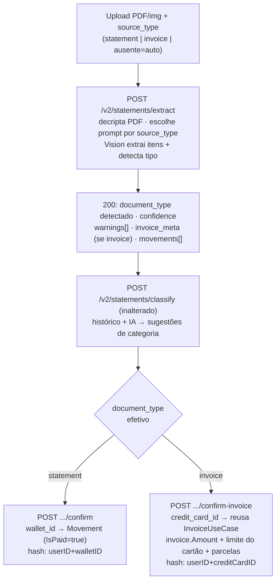
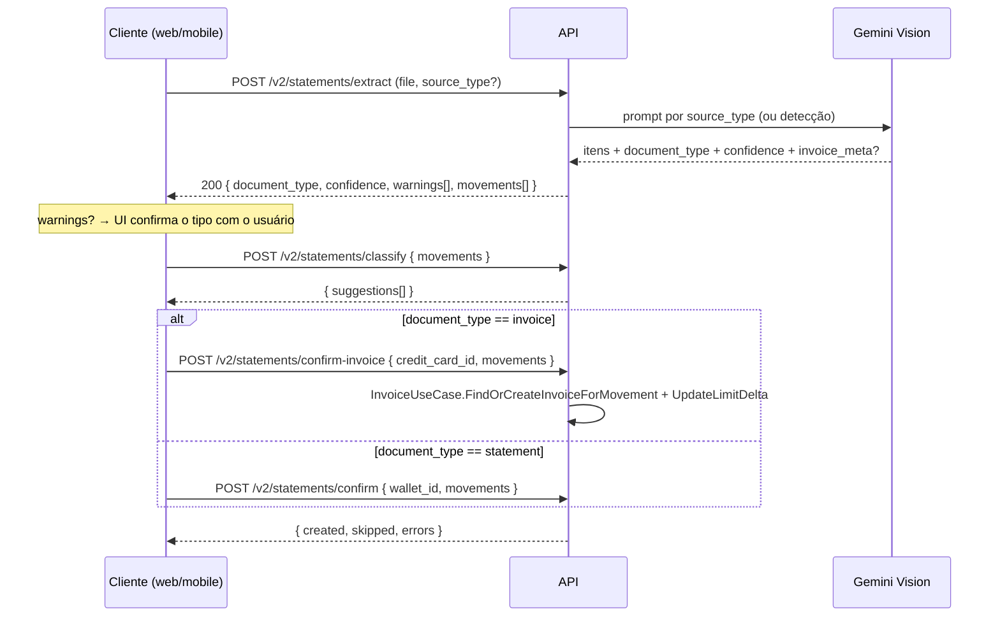

# AYD-004: Import de fatura de cartão de crédito (Invoice Import)

> **Nota de origem:** este AYD migra e formaliza o documento de análise `AyDimportfatura.md`,
> escrito na raiz do repo `personal-finance` (branch `claude/invoice-import-analysis-w5p3wx`,
> 25/jun/2026). O conteúdo técnico é preservado; a adaptação ao framework acrescenta a seção
> formal **Repos afetados e papéis** (o original só descrevia o escopo em prosa), detalha o
> mapeamento concreto de código em **web** e **mobile** (o original tinha apenas um guia de
> integração genérico em §9, sem nomes de arquivo) e converte o diagrama em ASCII para
> `mermaid`. Confirmado por leitura do código: nenhuma das 5 fases abaixo foi implementada
> ainda — `internal/infrastructure/api/statement_api.go`@api hoje só expõe
> `extract` / `classify` / `confirm`, e nem web nem mobile têm qualquer noção de
> `credit_card_id` no fluxo de import (ver §12 "Implementação por repo").

## Objetivo

Atender RF-07 (`requirements.md`): hoje o import de documento via IA só cobre **extrato
bancário** (`Statement`, escopado por `Wallet`). Esta feature estende o mesmo pipeline para
também importar **fatura de cartão de crédito** (`Invoice`, escopada por `CreditCard`),
recebendo formatos heterogêneos de diferentes bancos, com **diferenciação confiável** entre os
dois tipos de documento — sem depender de uma fonte de sinal só (nem a IA, nem a escolha do
usuário, isoladamente, são confiáveis o bastante com bancos heterogêneos).

## Repos afetados e papéis

| Repo | Papel nesta feature | Status do desenho | SPEC gerada |
|------|---------------------|--------------------|-------------|
| api | Generaliza `/v2/statements/{extract,classify}` para também detectar/extrair fatura (prompt dedicado, parcelas, metadados); novo endpoint `POST /v2/statements/confirm-invoice` que reusa a `InvoiceUseCase` já existente | Implementado (Phases 1–3): domain types, `ConfirmInvoice` usecase, 3 prompts Gemini (statement/invoice/auto), handler `confirm-invoice`, bootstrap wiring, 22 testes passando | SPEC-001@api |
| mobile | Hoje só importa extrato (escopado por `wallet_id`) via aba "import" do `MovementModal` → `StatementReviewScreen`. Precisa: enviar `source_type`, tratar `warnings`/parcelas na revisão, bifurcar o confirm para `confirm-invoice` com `credit_card_id`, e expor a entrada "Importar fatura" a partir da tela de cartões | Implementado (Phase 4): tipos alinhados ao contrato, `confirmInvoice`, hook `useConfirmInvoice`, `StatementReviewScreen` com bifurcação e badge de parcelas, entry point em `InvoiceDetailsModal`, strings i18n | SPEC-001@mobile |
| web | Hoje só importa extrato (escopado por `wallet_id`) via `StatementImportModal`, acionado pelo FAB global `AddMovementButton`. Mesmas mudanças de contrato do mobile; entrada natural é o card de fatura na página de cartões | Implementado (Phase 4): tipos alinhados, `extractMovements`/`confirmInvoice`, hook estendido com `resolvedMode`/`typeWarning`, modal com alerta de mismatch e badge de parcelas, botão "Importar fatura" em `invoice-summary-card`; issue aberta: `creditCardId` no card de resumo (ver SPEC-001@web) | SPEC-001@web |

> `children` fica vazio: nenhuma `SPEC` formal foi escrita ainda em nenhum repo. Este AYD fixa
> o contrato e os papéis; a SPEC@api (e, na sequência, SPEC@web/SPEC@mobile) é o próximo passo
> antes de implementar (ver "Fora de escopo").

## Sumário executivo (decisões-chave)

| Tema | Decisão |
|---|---|
| **Como diferenciar statement × invoice** | **Defesa em camadas**: (1) o cliente envia a **intenção** (`source_type`), porque na UI ele já escolheu "importar fatura do cartão X" vs "importar extrato da conta Y"; (2) a IA **também detecta** e devolve `document_type` + `confidence`; (3) divergência vira **warning não-fatal**, nunca hard-fail. |
| **Forma do "tipo"** | **Enum** `document_type` (`statement` / `invoice` / `unknown`), não um boolean — permite crescer (ex.: `receipt`) sem quebrar contrato. |
| **Superfície de API** | **Reusa** `/extract` e `/classify` (parametrizados por tipo); **bifurca só o confirm**, porque a persistência de fatura diverge estruturalmente. Novo endpoint **`POST /v2/statements/confirm-invoice`**. |
| **Persistência da fatura** | **Reusa a `InvoiceUseCase`** existente (`FindOrCreateInvoiceForMovement` + atualização de amount/limite) — não reimplementa regra de fatura; garante consistência com o lançamento manual de cartão. |
| **Idempotência** | Hash de idempotência escopado por **`credit_card_id`** (em vez de `wallet_id`) para itens de fatura. |
| **Compatibilidade** | 100% retrocompatível: clientes atuais chamando `/extract` + `/confirm` sem `source_type` continuam funcionando como hoje (`statement`). |



## Estado atual (api)

O import vive em **`/v2/statements`** (`internal/infrastructure/api/statement_api.go`), pipeline
de 3 etapas hoje **inteiramente voltado a extrato bancário**:

| Etapa | Endpoint | Camada | O que faz hoje |
|---|---|---|---|
| **Extract** | `POST /v2/statements/extract` | `StatementUseCase.Extract` → `GeminiVisionGateway.ExtractMovements` | Recebe PDF/imagem (multipart `file` + opcional `password`), valida tamanho/mime, decripta PDF protegido em memória, envia ao Gemini Vision com prompt **hardcoded de extrato**. Retorna `[]ExtractedMovement`. |
| **Classify** | `POST /v2/statements/classify` | `StatementUseCase.Classify` | Fase 1: lookup de histórico por descrição normalizada. Fase 2: batch para IA categorizar o que sobrou. Retorna `[]CategorySuggestion`. |
| **Confirm** | `POST /v2/statements/confirm` | `StatementUseCase.Confirm` | Calcula hash de idempotência, deduplica, insere `Movement` com `WalletID`, `IsPaid=true`. |

**Prompt atual** (`gemini_vision_gateway.go`): se o documento não for extrato, retorna
`{"error":"not_a_statement"}` → `domain.ErrStatementNotAStatement`. **Uma fatura cairia aqui e
seria rejeitada hoje.**

**Persistência de fatura já existente (caminho manual)**: `internal/usecase/invoice_usecase.go`
+ `movement_usecase.go` (`handleCreditCardMovement` → `getInvoice` →
`FindOrCreateInvoiceForMovement`, atualizando `invoice.Amount` e o limite do cartão
(`UpdateLimitDelta`), com suporte a parcelas via `GenerateInstallmentMovements`). **É essa
lógica que o import de fatura deve reusar**, não reimplementar.

## Gap — por que invoice não encaixa no fluxo atual

A diferença não é só o prompt. O `Confirm` do statement insere movimentos de carteira; uma
fatura precisa de um caminho de persistência distinto:

| Aspecto | Statement (`Confirm` hoje) | Invoice (necessário) |
|---|---|---|
| Vínculo principal | `WalletID` | `CreditCardInfo{CreditCardID, InvoiceID}` via `FindOrCreateInvoiceForMovement` |
| `IsPaid` | `true` (já caiu na conta) | `false` (paga-se a **fatura**, não o item) |
| `type_payment` | `debit_card` / `pix` / `ted` / `doc` | `credit_card` |
| Efeitos colaterais | nenhum além do insert | `invoiceRepo.UpdateAmount` + `creditCardRepo.UpdateLimitDelta` |
| Parcelas | inexistente | `PARCELA 03/12` → `InstallmentNumber` / `TotalInstallments` |
| Hash de idempotência | `userID + walletID + date + amount + desc` | escopo natural é `credit_card_id` |
| Metadados do documento | nenhum | fechamento, vencimento, total da fatura |
| Sinal do amount | `+` crédito / `-` débito | quase tudo é despesa; estornos/pagamentos invertem |

**Conclusão:** extract dá para generalizar via prompt; **o confirm precisa de um caminho
próprio** (`confirm-invoice`) que reaproveita a `InvoiceUseCase`.

## Princípios de desenho

1. **Diferenciação em camadas, não aposta única.** Intenção do usuário **e** detecção da IA,
   com reconciliação explícita.
2. **Falhar suave, não duro.** Documento ambíguo vira `unknown` + `warning` para a UI decidir —
   nunca um 4xx silencioso que trava o usuário.
3. **Reuso > reimplementação.** A regra de fatura já existe e é testada; o import a
   **orquestra**, não a duplica.
4. **Contrato estável e agnóstico.** Enum versionável, campos opcionais aditivos, erros com
   `type` legível por máquina — web e mobile programam contra a §"Contrato", não contra
   detalhes internos do Go.
5. **Retrocompatibilidade.** Tudo que existe hoje continua funcionando sem `source_type`.
6. **Incremental.** Entregar em fases; a Fase 1 não quebra nada existente.

## Estratégia de diferenciação statement × invoice

### As três fontes de verdade

| Fonte | Confiança | Papel |
|---|---|---|
| **Intenção do cliente** (`source_type` no request) | Alta na maioria dos casos | Na UI o usuário já escolheu o contexto ("Importar fatura do cartão X"). É de graça e quase sempre correta. |
| **Detecção da IA** (`document_type` + `confidence` na resposta) | Média/alta, varia por banco | Rede de segurança para o caso em que o usuário sobe o arquivo errado. |
| **Heurísticas estruturais** (opcional, barato) | Média | Sinais fortes no texto ("fatura/vencimento/limite/parcela" vs "saldo/extrato/agência") reforçam a detecção sem custo de LLM. |

### Matriz de reconciliação

| `source_type` (cliente) | `document_type` (IA) | Resultado | Ação |
|---|---|---|---|
| `invoice` | `invoice` | ✅ acordo | segue para `confirm-invoice` |
| `statement` | `statement` | ✅ acordo | segue para `confirm` |
| `invoice` | `statement` (ou vice-versa) | ⚠️ mismatch | `200` com `warnings: [{type: "document_type_mismatch", expected, detected}]`; UI confirma com o usuário |
| qualquer | `unknown` / confiança baixa | ⚠️ incerto | `200` com warning `low_confidence`; UI pede confirmação |
| ausente (auto) | `invoice`/`statement` | ℹ️ IA decide | usa o detectado; UI mostra "detectamos uma fatura, confirma?" |
| ausente (auto) | `unknown` | ⚠️ incerto | UI pergunta o tipo explicitamente |

> **Regra de ouro:** a extração **nunca falha** por ambiguidade de tipo; sempre retorna `200`
> com o que conseguiu extrair + os warnings. Quem decide o caminho de `confirm` é o cliente,
> com base nos sinais. Isso substitui o atual `ErrStatementNotAStatement` (hard-fail) por
> `document_type: "unknown"` informativo.

Limiar de confiança: reusa a constante já existente `ClassificationConfidenceThreshold = 0.6`
(`statement_usecase.go`); `confidence < 0.6` na detecção de tipo dispara `low_confidence`.

## Contrato (fonte da verdade)

> Esta seção é a fonte da verdade para web e mobile. Campos marcados *(novo)* ainda não
> existem; o restante é o comportamento atual mantido.

**Enum `document_type`:** `"statement"` (extrato bancário) | `"invoice"` (fatura de cartão) |
`"unknown"` (IA não conseguiu determinar com confiança).

### `POST /v2/statements/extract`

**Request** — `multipart/form-data`:

| Campo | Tipo | Obrig. | Descrição |
|---|---|---|---|
| `file` | binário | sim | PDF, JPEG ou PNG. Máx 10 MB. |
| `password` | string | não | Senha de abertura para PDF protegido. |
| `source_type` *(novo)* | string | não | `statement` \| `invoice`. **Ausente = modo auto** (IA decide). Retrocompatível. |

**Response `200`** (campos novos são aditivos):

```jsonc
{
  "document_type": "invoice",          // (novo) tipo detectado pela IA
  "confidence": 0.94,                  // (novo) 0.0–1.0
  "warnings": [                         // (novo) não-fatais; [] quando tudo ok
    { "type": "document_type_mismatch", "expected": "statement", "detected": "invoice" }
  ],
  "invoice_meta": {                     // (novo) presente só quando invoice
    "closing_date": "2026-06-03",
    "due_date": "2026-06-10",
    "total_amount": -3450.27
  },
  "movements": [
    {
      "date": "2026-05-12",
      "description": "MERCADO LIVRE PARCELA 03/12",
      "amount": -120.00,
      "type_payment": "credit_card",
      "installment_number": 3,         // (novo) só invoice, se houver parcela
      "total_installments": 12         // (novo) só invoice, se houver parcela
    }
  ],
  "errors": ["movement #7: missing date"]
}
```

**Erros (typed):** arquivo > 10MB (413/422); mime inválido (400); PDF protegido sem senha
(422, `statement_password_required`); senha incorreta (422, `statement_wrong_password`).
~~Documento não é extrato (422)~~ — **removido**, vira `document_type: "unknown"` + warning
na resposta `200`.

### `POST /v2/statements/classify` — inalterado

`{ "movements": [...] }` → `{ "suggestions": [{description, category_id, subcategory_id,
confidence, source}] }`, `source` ∈ `"history" | "ai"`. Igual para itens de extrato e fatura.

### `POST /v2/statements/confirm` — inalterado (caminho statement)

```jsonc
// request: { "wallet_id": "uuid", "movements": [ ExtractedMovement, ... ] }
// response: { "created": 12, "skipped": 3, "errors": ["..."] }
```

### `POST /v2/statements/confirm-invoice` *(novo)* — caminho invoice

**Request:**

```jsonc
{
  "credit_card_id": "uuid",            // obrigatório — substitui wallet_id
  "invoice_id": "uuid|null",           // opcional: força a fatura alvo; senão resolve pela data
  "movements": [
    {
      "date": "2026-05-12",
      "description": "MERCADO LIVRE PARCELA 03/12",
      "amount": -120.00,
      "category_id": "uuid|null",
      "sub_category_id": "uuid|null",
      "installment_number": 3,
      "total_installments": 12
    }
  ]
}
```

**Response** (mesmo shape do confirm de statement): `{ "created": 18, "skipped": 2, "errors":
["..."] }`.

**Semântica (backend):** monta `Movement` com `TypePayment = credit_card`, `IsPaid = false` e
`CreditCardInfo{CreditCardID, InvoiceID}`, delega à `InvoiceUseCase` para resolver/criar a
fatura por data, somar em `invoice.Amount` e no limite do cartão. Itens parcelados geram a
série via `GenerateInstallmentMovements`. Dedup por hash escopado por `credit_card_id`.

**Erros adicionais:** `credit_card_id` ausente/inexistente (400/404); cartão sem carteira
default e item sem wallet (400, `ErrCreditCardNoDefaultWallet`); estouro de limite (403,
`ErrCreditCardLimitReached`); fatura alvo já paga (422).

**Contrato de erro global** (inalterado): `{ "error": { "code": 422, "message": "...", "type":
"opcional" } }`. Clientes ramificam por `error.type` quando presente.

## Modelo de domínio e dados (api)

```go
// ExtractedMovement (aditivo)
type ExtractedMovement struct {
    // ... campos atuais ...
    InstallmentNumber *int `json:"installment_number,omitempty"` // (novo)
    TotalInstallments *int `json:"total_installments,omitempty"` // (novo)
}

type DocumentType string
const (
    DocStatement DocumentType = "statement"
    DocInvoice   DocumentType = "invoice"
    DocUnknown   DocumentType = "unknown"
)

type ExtractWarning struct {
    Type     string `json:"type"`               // "document_type_mismatch" | "low_confidence"
    Expected string `json:"expected,omitempty"`
    Detected string `json:"detected,omitempty"`
}

type InvoiceMeta struct {
    ClosingDate *string  `json:"closing_date,omitempty"`
    DueDate     *string  `json:"due_date,omitempty"`
    TotalAmount *float64 `json:"total_amount,omitempty"`
}

// StatementExtractResult ganha (aditivo): DocumentType, Confidence, Warnings, InvoiceMeta

type InvoiceConfirmInput struct {
    CreditCardID uuid.UUID           `json:"credit_card_id"`
    InvoiceID    *uuid.UUID          `json:"invoice_id,omitempty"`
    Movements    []ExtractedMovement `json:"movements"`
}
```

**Idempotência por cartão:** generaliza `ComputeIdempotencyHash` (`statement.go`) para aceitar
o escopo. Hoje: `userID|walletID|date|amount|desc`. Para fatura:
`userID|creditCardID|date|amount|desc`.

**Reuso, não reescrita:** `confirm-invoice` orquestra a `InvoiceUseCase` já existente —
`FindOrCreateInvoiceForMovement`, `UpdateAmount` + `creditCardRepo.UpdateLimitDelta`,
`GenerateInstallmentMovements`. **Decisão de design:** o `StatementUseCase` ganha um método
`ConfirmInvoice` que injeta a `InvoiceUseCase` (e `creditCardRepo`); wiring em
`internal/bootstrap/statement/setup.go`, pegando dependências do registry como os demais
features clean-arch.

## Prompts da IA (api)

Seleção por `source_type` em vez de um prompt genérico tentando adivinhar tudo:

| `source_type` | Prompt usado | Saída |
|---|---|---|
| `statement` | prompt de extrato (atual) | itens + `document_type` confirmado |
| `invoice` | **prompt de fatura** *(novo)* | itens (sempre `credit_card`) + parcelas + `invoice_meta` |
| ausente (auto) | **prompt de detecção** *(novo)* | classifica o tipo, depois extrai conforme o tipo |

**Prompt de fatura — pontos obrigatórios:** manter o bloco anti-prompt-injection atual
(documento é dado passivo); extrair `date/description/amount` (negativo para compras,
positivo para estornos/pagamentos); detectar parcelas (`"03/12"`, `"PARC 3/12"`, `"PARCELA 03
DE 12"`) → `installment_number`/`total_installments`; extrair `invoice_meta` quando legível;
sempre `type_payment: "credit_card"`; retornar `document_type: "unknown"` (não
`{"error":...}`) quando ambíguo.

**Prompt de detecção (auto):** retorna `{document_type, confidence}` + os movimentos no
formato do tipo detectado, num único call. **Token usage:** manter
`recordTokenUsage(ctx, "statement_extract", ...)`; adicionar feature label
`"invoice_extract"` para separar custo nas métricas de negócio (`biz_ai_tokens_total` — ver
AYD-002).

## Fluxo cross-repo



## Implementação por repo

> Mapa de código **hoje** (lido diretamente dos repos) e os pontos de extensão que cada um
> precisa para suportar invoice — a parte que o documento original deixava só como guia
> genérico de integração.

### api — mapa de arquivos planejado

| Camada | Arquivo | Mudança |
|---|---|---|
| Domínio | `internal/domain/statement.go` | `DocumentType`, `ExtractWarning`, `InvoiceMeta`, `InvoiceConfirmInput`, campos de parcela, hash por escopo |
| Usecase | `internal/usecase/statement_usecase.go` | método `ConfirmInvoice`, injeção de `InvoiceUseCase`/`creditCardRepo` |
| Gateway | `internal/infrastructure/gateway/gemini_vision_gateway.go` | prompts de fatura/detecção, seleção por `source_type`, retorno de tipo/meta |
| API | `internal/infrastructure/api/statement_api.go` | ler `source_type` no `/extract`; handler `ConfirmInvoice` |
| Bootstrap | `internal/bootstrap/statement/setup.go` | wiring da `InvoiceUseCase` + `creditCardRepo` no `StatementUseCase` |
| Reuso (sem alteração) | `internal/usecase/invoice_usecase.go`, `internal/usecase/movement.go` | apenas consumidos |

### mobile — código atual e pontos de extensão

Hoje o import é **só de extrato**, escopado por `wallet_id`, sem qualquer noção de
`credit_card_id`:

```
MovementModal (aba "import", expo-document-picker)
  └─ useExtractStatement()              (src/hooks/use-statements.ts)
       └─ extractStatement()            (src/lib/api/statements.ts → fetch direto, multipart)
            └─ POST /v2/statements/extract
  → navega para StatementReviewScreen
       ├─ MovementReviewCard            (edita item)
       ├─ CategoryPickerSheet
       ├─ RecurrenceLinkSheet
       ├─ useClassifyStatement() / useConfirmStatement()
       └─ ImportResultModal             ({created, skipped, errors})
```

Tipos hoje em `src/types/statement.ts`: `ExtractedMovement`, `ClassifySuggestion`,
`ReviewMovement`, `ConfirmPayload` (só `wallet_id`).

**Pontos de extensão (Fase 4):**
- `extractStatement` precisa enviar `source_type`; `ExtractResponse` ganha
  `document_type/confidence/warnings/invoice_meta`.
- `StatementReviewScreen` precisa renderizar `warnings` (modal de confirmação de tipo) e os
  campos de parcela.
- Novo `confirmInvoiceStatement()` (ou bifurcação em `confirmStatement`) chamando
  `/confirm-invoice` com `credit_card_id` em vez de `wallet_id`.
- **Entrada "Importar fatura":** não existe hoje nenhum ponto de entrada de import a partir de
  um cartão. O candidato natural é a tela de cartões (`CreditCardsScreen.tsx` /
  `InvoiceDetailsModal.tsx`, em `src/components/invoices/`), espelhando o padrão já usado pela
  aba "import" do `MovementModal`.

### web — código atual e pontos de extensão

Mesma situação: import **só de extrato**, escopado por `wallet_id`:

```
AddMovementButton (FAB global, feature flag NEXT_PUBLIC_STATEMENT_IMPORT_ENABLED)
  └─ StatementImportModal
       └─ useStatementImport()          (hooks/use-statement-import.ts)
            ├─ extractMovements()       (fetch direto, multipart, inline no hook)
            ├─ classifyMovements()      (lib/api/statements.ts)
            └─ confirmImport(walletId)  (fetcher direto, inline no hook)
       ├─ StatementImportList / StatementImportItem
       ├─ MovementCategorySelector
       └─ RecurrentMatchSelector
```

Tipos hoje em `types/statement-import.ts`: `ExtractedMovement` (com `recurrentMatch`,
`confidence`, `classificationSource` — já mais rico que o do mobile), `ConfirmRequest` (só
`walletId`).

**Pontos de extensão (Fase 4):** mesmas mudanças de contrato do mobile (`source_type`,
`warnings`, `invoice_meta`, bifurcação do confirm). **Entrada "Importar fatura":** o candidato
natural é `app/credit-cards/components/invoice-summary-card.tsx`, renderizado por cartão na
página `app/credit-cards/page.tsx` — hoje sem nenhuma ação de import.

> **Achado a resolver na SPEC (não bloqueia este AYD):** os tipos `ExtractedMovement` de web e
> mobile já **divergiram entre si** (mobile: `ClassifySuggestion` plano; web: `recurrentMatch`
> aninhado + `confidence`/`classificationSource` no nível do movimento) e nenhum dos dois é
> 1:1 com o `domain.ExtractedMovement`@api da §"Modelo de domínio". Ao escrever SPEC@web e
> SPEC@mobile para esta feature, alinhar os três ao contrato desta seção antes de adicionar
> os campos novos de invoice — não compor mais divergência sobre divergência existente.

## Guia de integração (passo a passo de UI)

1. **Tela de import já sabe o contexto** → enviar `source_type`: fluxo a partir de um cartão
   ⇒ `invoice`; fluxo a partir de uma carteira ⇒ `statement`; fluxo genérico ⇒ omitir (auto).
2. **Chamar `/extract`.** Tratar `statement_password_required` (pedir senha) e
   `statement_wrong_password`.
3. **Ler `warnings` da resposta `200`:** `document_type_mismatch` → modal "Você selecionou X,
   mas isto parece ser Y. Importar como Y?"; `low_confidence`/`unknown` → pedir ao usuário que
   escolha o tipo.
4. **Chamar `/classify`** com os `movements` (igual para os dois tipos).
5. **Bifurcar o confirm pelo tipo efetivo:** `statement` → `/confirm` (`wallet_id`); `invoice`
   → `/confirm-invoice` (`credit_card_id`, e `invoice_id` se a UI já tiver a fatura aberta).
6. **Parcelas (invoice):** exibir `installment_number/total_installments`; avisar que a
   compra parcelada gera N lançamentos futuros (a série completa é criada pelo backend).
7. **Correlação:** enviar `X-Request-ID` no `fetcher.ts` de cada repo também nessas chamadas,
   por consistência com o contrato de correlação definido em AYD-002.

## Plano de implementação faseado

| Fase | Entregas | Quebra contrato? | Esforço |
|---|---|---|---|
| 1 — Detecção sem quebra | `/extract` aceita `source_type`; resposta ganha `document_type`/`confidence`/`warnings`; troca `not_a_statement` por `unknown`+warning; prompt de detecção | Não (aditivo) | S |
| 2 — Extração de fatura | Prompt de fatura dedicado; parsing de parcelas; `invoice_meta`; feature label de tokens | Não (aditivo) | M |
| 3 — Persistência de fatura | `InvoiceConfirmInput` + `StatementUseCase.ConfirmInvoice`; endpoint `confirm-invoice`; hash por `credit_card_id`; wiring; testes | Não (novo endpoint) | M |
| 4 — Frontends | Web e mobile: `source_type`, tratamento de `warnings`, bifurcação do confirm, UI de parcelas, entrada "Importar fatura" a partir da tela de cartões (ver §"Implementação por repo") | Consome contrato | M |
| 5 — Endurecimento | Validação do total (`invoice_meta.total_amount` × soma dos itens) como warning; métricas de negócio (`biz_invoice_imports_total`); telemetria de mismatch | Não | S |

## Riscos e mitigações

| Risco | Mitigação |
|---|---|
| IA classifica tipo errado (bancos heterogêneos) | Defesa em camadas: intenção + detecção + warning de mismatch; nunca decide sozinha o `confirm` |
| Parcelas mal interpretadas (formatos variados de "x/y") | Prompt com exemplos múltiplos; campos opcionais — na dúvida, importa como lançamento simples; UI permite revisar antes do confirm |
| Import duplicado ao reenviar a mesma fatura | Hash de idempotência por `credit_card_id` + dedup (mesma estratégia já provada no statement) |
| Total da fatura não bate com soma dos itens (OCR perdeu linha) | Fase 5: compara `invoice_meta.total_amount` com a soma; divergência vira warning, não bloqueio |
| Importar em fatura já paga/fechada | `ConfirmInvoice` valida status da invoice (`ErrInvoiceCannotModify`/`ErrInvoiceAlreadyPaid`) |
| Estouro de limite ao importar fatura grande | Reusa `validateCreditLimit` da `InvoiceUseCase`; `ErrCreditCardLimitReached` (403) |
| Custo de LLM sobe com dois prompts | Modo auto faz detecção+extração num único call; tokens medidos por feature (`invoice_extract`) |
| Frontends antigos quebrarem | Tudo aditivo; ausência de `source_type` = comportamento atual (statement) |
| Tipos `ExtractedMovement` já divergentes entre web/mobile (ver §"Implementação por repo") | Alinhar os três ao contrato desta seção na SPEC@web/SPEC@mobile, antes de empilhar campos novos |

## Decisões de design (confirmadas)

> Decididas em jun/2026 — as cinco seguiram a recomendação; o corpo do AYD já reflete estas
> escolhas.

| # | Decisão |
|---|---|
| 1 | **Endpoint do confirm de fatura:** `POST /v2/statements/confirm-invoice` — mantém coesão com o pipeline `extract/classify` no mesmo grupo de rotas. (`/v2/invoices/import` descartado.) |
| 2 | **Resolução da fatura alvo:** por **data de cada item** via `FindOrCreateInvoiceForMovement` (cobre faturas que cruzam o fechamento), com `invoice_id` opcional como override quando a UI já tem a fatura aberta. |
| 3 | **Validação de total:** divergência entre `invoice_meta.total_amount` e a soma dos itens vira **warning informativo** (não bloqueia); usuário decide importar mesmo assim. Implementada na Fase 5. |
| 4 | **Modo auto (sem `source_type`):** roda detecção da IA; quando o resultado for `unknown`, o `confirm` legado trata como `statement`, preservando clientes atuais. |
| 5 | **Sinal do `amount` na fatura:** despesa **negativa** (compras `-`, estornos/pagamentos `+`), consistente com o resto do app (`movement.go` usa `amount < 0` como despesa). |

## Vocabulário específico deste contrato

> `Statement`, `Invoice` e parcelamento (`installment_group_id`) já são termos canônicos do
> `GLO` — não redefinidos aqui (conventions.md §5). Os dois termos abaixo são vocabulário novo
> **da API**, não conceitos de domínio ubíquos, por isso ficam só aqui:

| Termo | Significado |
|---|---|
| `document_type` | Enum que diferencia o documento importado (`statement`/`invoice`/`unknown`); resultado da **detecção** pela IA. |
| `source_type` | Intenção declarada pelo **cliente** no `/extract` (qual tipo ele acha que está enviando); reconciliada com `document_type` (ver matriz de reconciliação). |

## Decisões relacionadas

- **Correlação cross-repo (`X-Request-ID`):** este fluxo deve seguir o mesmo contrato de
  correlação definido em **AYD-002** (item 7 do contrato de telemetria) — web e mobile geram o
  header a partir do mesmo `fetcher.ts` único, sem ponto de injeção adicional.
- **Nenhum `ADR` aplicável ainda** — esta feature não adiciona/remove serviço ou integração
  externa (Gemini Vision já é usado para `Statement`, já registrado em `architecture.md`); é
  extensão de contrato, não mudança de topologia.

## Fora de escopo / questões em aberto

- [x] **SPEC@api** — SPEC-001@api criada; Phases 1–3 implementadas e testadas (22 testes passando).
- [x] **SPEC@web / SPEC@mobile** — SPEC-001@web e SPEC-001@mobile criadas; Phase 4 implementada; divergência de tipos `ExtractedMovement` resolvida (alinhados ao contrato desta seção).
- [ ] **`creditCardId` no `invoice-summary-card`@web** — card de resumo total não expõe o ID do cartão; solução a definir na SPEC@web (passar via props do `credit-cards/page.tsx` ou reestruturar o componente).
- [ ] **Fase 5 (endurecimento)** — validação de total e métricas de negócio do import de
      fatura; pendente, não bloqueia as Fases 1–4.
- [ ] **Heurísticas estruturais** (§"Estratégia de diferenciação") — mencionadas como reforço
      opcional e barato, mas não fazem parte do contrato; decidir se entram numa fase futura.
