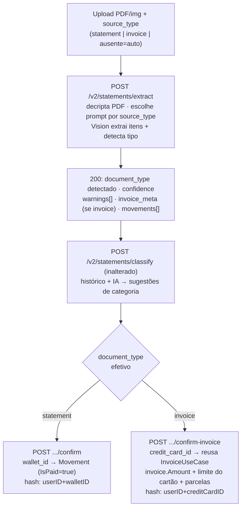
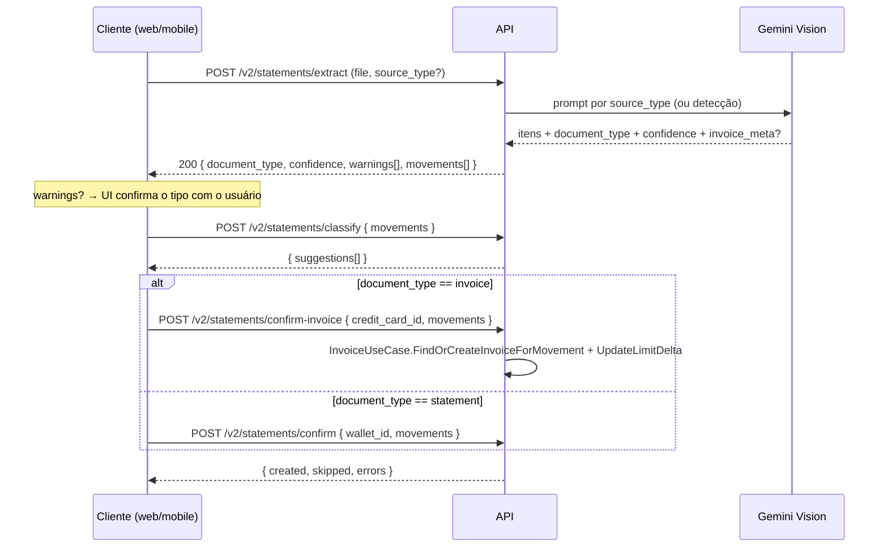

# AYD-004: Import de fatura de cartão de crédito (Invoice Import)

> **Nota de origem:** este AYD migra e formaliza o documento de análise `AyDimportfatura.md`,
> escrito na raiz do repo `personal-finance` (branch `claude/invoice-import-analysis-w5p3wx`,
> 25/jun/2026). O conteúdo técnico é preservado; a adaptação ao framework acrescenta a seção
> formal **Repos afetados e papéis** (o original só descrevia o escopo em prosa), detalha o
> mapeamento concreto de código em **web** e **mobile** (o original tinha apenas um guia de
> integração genérico em §9, sem nomes de arquivo) e converte o diagrama em ASCII para
> `mermaid`. Confirmado por leitura do código: nenhuma das 5 fases abaixo foi implementada
> ainda — `internal/infrastructure/api/statement_api.go`@api hoje só expõe
> `extract` / `classify` / `confirm`, e nem web nem mobile têm qualquer noção de
> `credit_card_id` no fluxo de import (ver §12 "Implementação por repo").

## Objetivo

Atender RF-07 (`requirements.md`): hoje o import de documento via IA só cobre **extrato
bancário** (`Statement`, escopado por `Wallet`). Esta feature estende o mesmo pipeline para
também importar **fatura de cartão de crédito** (`Invoice`, escopada por `CreditCard`),
recebendo formatos heterogêneos de diferentes bancos, com **diferenciação confiável** entre os
dois tipos de documento — sem depender de uma fonte de sinal só (nem a IA, nem a escolha do
usuário, isoladamente, são confiáveis o bastante com bancos heterogêneos).

## Repos afetados e papéis

| Repo | Papel nesta feature | Status do desenho | SPEC gerada |
|------|---------------------|--------------------|-------------|
| api | Generaliza `/v2/statements/{extract,classify}` para também detectar/extrair fatura (prompt dedicado, parcelas, metadados); novo endpoint `POST /v2/statements/confirm-invoice` que reusa a `InvoiceUseCase` já existente | Implementado (Phases 1–3): domain types, `ConfirmInvoice` usecase, 3 prompts Gemini (statement/invoice/auto), handler `confirm-invoice`, bootstrap wiring, 22 testes passando; Fase 5 parcial (exclusão do pagamento + `total_amount_mismatch`). **Pendente: Fase 6** | SPEC-001@api |
| mobile | Hoje só importa extrato (escopado por `wallet_id`) via aba "import" do `MovementModal` → `StatementReviewScreen`. Precisa: enviar `source_type`, tratar `warnings`/parcelas na revisão, bifurcar o confirm para `confirm-invoice` com `credit_card_id`, e expor a entrada "Importar fatura" a partir da tela de cartões | Implementado (Phase 4): tipos alinhados ao contrato, `confirmInvoice`, hook `useConfirmInvoice`, `StatementReviewScreen` com bifurcação e badge de parcelas, entry point em `InvoiceDetailsModal`, strings i18n. **Pendente: Fase 6** (item marcado/`excluded`, chip de vínculo de parcela, sheet de vínculo manual) | SPEC-001@mobile |
| web | Hoje só importa extrato (escopado por `wallet_id`) via `StatementImportModal`, acionado pelo FAB global `AddMovementButton`. Mesmas mudanças de contrato do mobile; entrada natural é o card de fatura na página de cartões | Implementado (Phase 4): tipos alinhados, `extractMovements`/`confirmInvoice`, hook estendido com `resolvedMode`/`typeWarning`, modal com alerta de mismatch e badge de parcelas, botão "Importar fatura" em `invoice-summary-card`; issue aberta: `creditCardId` no card de resumo (ver SPEC-001@web). **Pendente: Fase 6** (item marcado/`excluded`, chip de vínculo de parcela, vínculo manual) | SPEC-001@web |

> As três SPECs existem e estão ligadas em `children`. **Fase 6 (reconciliação de parcelas)
> ainda não foi implementada em nenhum repo** — o contrato dela está fixado abaixo
> (§"Parcelas já registradas no app", Decisões 7 e 8) e as SPECs precisam absorvê-lo.

## Sumário executivo (decisões-chave)

| Tema | Decisão |
|---|---|
| **Como diferenciar statement × invoice** | **Defesa em camadas**: (1) o cliente envia a **intenção** (`source_type`), porque na UI ele já escolheu "importar fatura do cartão X" vs "importar extrato da conta Y"; (2) a IA **também detecta** e devolve `document_type` + `confidence`; (3) divergência vira **warning não-fatal**, nunca hard-fail. |
| **Forma do "tipo"** | **Enum** `document_type` (`statement` / `invoice` / `unknown`), não um boolean — permite crescer (ex.: `receipt`) sem quebrar contrato. |
| **Superfície de API** | **Reusa** `/extract` e `/classify` (parametrizados por tipo); **bifurca só o confirm**, porque a persistência de fatura diverge estruturalmente. Novo endpoint **`POST /v2/statements/confirm-invoice`**. |
| **Persistência da fatura** | **Reusa a `InvoiceUseCase`** existente (`FindOrCreateInvoiceForMovement` + atualização de amount/limite) — não reimplementa regra de fatura; garante consistência com o lançamento manual de cartão. |
| **Idempotência** | Hash de idempotência escopado por **`credit_card_id`** (em vez de `wallet_id`) para itens de fatura. O hash é dedup **da mesma fonte**; reconciliar com lançamentos manuais exige matcher semântico (ver abaixo). |
| **Itens que não são despesa desta fatura** | Pagamento da fatura anterior e parcelas de competência futura são **marcados, nunca removidos** (`excluded` + `exclusion_reason`); a UI os mostra desmarcados e o `confirm-invoice` reaplica a detecção. |
| **Parcela já registrada no app** | O servidor **sugere o vínculo** com a série existente (`installment_match`), o cliente **decide** (`installment_group_id`), e o confirm **atualiza o valor** da parcela e **pula a série inteira** em vez de criar duplicatas. |
| **Compatibilidade** | 100% retrocompatível: clientes atuais chamando `/extract` + `/confirm` sem `source_type` continuam funcionando como hoje (`statement`). |


```mermaid
flowchart TB
    U["Upload PDF/img + source_type<br/>(statement | invoice | ausente=auto)"] --> EXT
    EXT["POST /v2/statements/extract<br/>decripta PDF · escolhe prompt por source_type<br/>Vision extrai itens + detecta tipo"] --> RESP
    RESP["200: document_type detectado · confidence<br/>warnings[] · invoice_meta (se invoice) · movements[]"] --> CLS
    CLS["POST /v2/statements/classify (inalterado)<br/>histórico + IA → sugestões de categoria"] --> DEC
    DEC{"document_type<br/>efetivo"}
    DEC -->|statement| CONF["POST .../confirm<br/>wallet_id → Movement (IsPaid=true)<br/>hash: userID+walletID"]
    DEC -->|invoice| CONFI["POST .../confirm-invoice<br/>credit_card_id → reusa InvoiceUseCase<br/>invoice.Amount + limite do cartão + parcelas<br/>hash: userID+creditCardID"]
```

## Estado atual (api)

O import vive em **`/v2/statements`** (`internal/infrastructure/api/statement_api.go`), pipeline
de 3 etapas hoje **inteiramente voltado a extrato bancário**:

| Etapa | Endpoint | Camada | O que faz hoje |
|---|---|---|---|
| **Extract** | `POST /v2/statements/extract` | `StatementUseCase.Extract` → `GeminiVisionGateway.ExtractMovements` | Recebe PDF/imagem (multipart `file` + opcional `password`), valida tamanho/mime, decripta PDF protegido em memória, envia ao Gemini Vision com prompt **hardcoded de extrato**. Retorna `[]ExtractedMovement`. |
| **Classify** | `POST /v2/statements/classify` | `StatementUseCase.Classify` | Fase 1: lookup de histórico por descrição normalizada. Fase 2: batch para IA categorizar o que sobrou. Retorna `[]CategorySuggestion`. |
| **Confirm** | `POST /v2/statements/confirm` | `StatementUseCase.Confirm` | Calcula hash de idempotência, deduplica, insere `Movement` com `WalletID`, `IsPaid=true`. |

**Prompt atual** (`gemini_vision_gateway.go`): se o documento não for extrato, retorna
`{"error":"not_a_statement"}` → `domain.ErrStatementNotAStatement`. **Uma fatura cairia aqui e
seria rejeitada hoje.**

**Persistência de fatura já existente (caminho manual)**: `internal/usecase/invoice_usecase.go`
+ `movement_usecase.go` (`handleCreditCardMovement` → `getInvoice` →
`FindOrCreateInvoiceForMovement`, atualizando `invoice.Amount` e o limite do cartão
(`UpdateLimitDelta`), com suporte a parcelas via `GenerateInstallmentMovements`). **É essa
lógica que o import de fatura deve reusar**, não reimplementar.

## Gap — por que invoice não encaixa no fluxo atual

A diferença não é só o prompt. O `Confirm` do statement insere movimentos de carteira; uma
fatura precisa de um caminho de persistência distinto:

| Aspecto | Statement (`Confirm` hoje) | Invoice (necessário) |
|---|---|---|
| Vínculo principal | `WalletID` | `CreditCardInfo{CreditCardID, InvoiceID}` via `FindOrCreateInvoiceForMovement` |
| `IsPaid` | `true` (já caiu na conta) | `false` (paga-se a **fatura**, não o item) |
| `type_payment` | `debit_card` / `pix` / `ted` / `doc` | `credit_card` |
| Efeitos colaterais | nenhum além do insert | `invoiceRepo.UpdateAmount` + `creditCardRepo.UpdateLimitDelta` |
| Parcelas | inexistente | `PARCELA 03/12` → `InstallmentNumber` / `TotalInstallments` |
| Hash de idempotência | `userID + walletID + date + amount + desc` | escopo natural é `credit_card_id` |
| Metadados do documento | nenhum | fechamento, vencimento, total da fatura |
| Sinal do amount | `+` crédito / `-` débito | quase tudo é despesa; estornos/pagamentos invertem |

**Conclusão:** extract dá para generalizar via prompt; **o confirm precisa de um caminho
próprio** (`confirm-invoice`) que reaproveita a `InvoiceUseCase`.

## Princípios de desenho

1. **Diferenciação em camadas, não aposta única.** Intenção do usuário **e** detecção da IA,
   com reconciliação explícita.
2. **Falhar suave, não duro.** Documento ambíguo vira `unknown` + `warning` para a UI decidir —
   nunca um 4xx silencioso que trava o usuário.
3. **Reuso > reimplementação.** A regra de fatura já existe e é testada; o import a
   **orquestra**, não a duplica.
4. **Contrato estável e agnóstico.** Enum versionável, campos opcionais aditivos, erros com
   `type` legível por máquina — web e mobile programam contra a §"Contrato", não contra
   detalhes internos do Go.
5. **Retrocompatibilidade.** Tudo que existe hoje continua funcionando sem `source_type`.
6. **Incremental.** Entregar em fases; a Fase 1 não quebra nada existente.

## Estratégia de diferenciação statement × invoice

### As três fontes de verdade

| Fonte | Confiança | Papel |
|---|---|---|
| **Intenção do cliente** (`source_type` no request) | Alta na maioria dos casos | Na UI o usuário já escolheu o contexto ("Importar fatura do cartão X"). É de graça e quase sempre correta. |
| **Detecção da IA** (`document_type` + `confidence` na resposta) | Média/alta, varia por banco | Rede de segurança para o caso em que o usuário sobe o arquivo errado. |
| **Heurísticas estruturais** (opcional, barato) | Média | Sinais fortes no texto ("fatura/vencimento/limite/parcela" vs "saldo/extrato/agência") reforçam a detecção sem custo de LLM. |

### Matriz de reconciliação

| `source_type` (cliente) | `document_type` (IA) | Resultado | Ação |
|---|---|---|---|
| `invoice` | `invoice` | ✅ acordo | segue para `confirm-invoice` |
| `statement` | `statement` | ✅ acordo | segue para `confirm` |
| `invoice` | `statement` (ou vice-versa) | ⚠️ mismatch | `200` com `warnings: [{type: "document_type_mismatch", expected, detected}]`; UI confirma com o usuário |
| qualquer | `unknown` / confiança baixa | ⚠️ incerto | `200` com warning `low_confidence`; UI pede confirmação |
| ausente (auto) | `invoice`/`statement` | ℹ️ IA decide | usa o detectado; UI mostra "detectamos uma fatura, confirma?" |
| ausente (auto) | `unknown` | ⚠️ incerto | UI pergunta o tipo explicitamente |

> **Regra de ouro:** a extração **nunca falha** por ambiguidade de tipo; sempre retorna `200`
> com o que conseguiu extrair + os warnings. Quem decide o caminho de `confirm` é o cliente,
> com base nos sinais. Isso substitui o atual `ErrStatementNotAStatement` (hard-fail) por
> `document_type: "unknown"` informativo.

Limiar de confiança: reusa a constante já existente `ClassificationConfidenceThreshold = 0.6`
(`statement_usecase.go`); `confidence < 0.6` na detecção de tipo dispara `low_confidence`.

## Contrato (fonte da verdade)

> Esta seção é a fonte da verdade para web e mobile. Campos marcados *(novo)* ainda não
> existem; o restante é o comportamento atual mantido.

**Enum `document_type`:** `"statement"` (extrato bancário) | `"invoice"` (fatura de cartão) |
`"unknown"` (IA não conseguiu determinar com confiança).

### `POST /v2/statements/extract`

**Request** — `multipart/form-data`:

| Campo | Tipo | Obrig. | Descrição |
|---|---|---|---|
| `file` | binário | sim | PDF, JPEG ou PNG. Máx 10 MB. |
| `password` | string | não | Senha de abertura para PDF protegido. |
| `source_type` *(novo)* | string | não | `statement` \| `invoice`. **Ausente = modo auto** (IA decide). Retrocompatível. |

**Response `200`** (campos novos são aditivos):

```jsonc
{
  "document_type": "invoice",          // (novo) tipo detectado pela IA
  "confidence": 0.94,                  // (novo) 0.0–1.0
  "warnings": [                         // (novo) não-fatais; [] quando tudo ok
    { "type": "document_type_mismatch", "expected": "statement", "detected": "invoice" },
    { "type": "invoice_payment_excluded" },
    { "type": "future_installment_excluded" },
    { "type": "installment_match_found" },
    { "type": "total_amount_mismatch", "expected": "-6035.06", "detected": "-11247.65" }
  ],
  "invoice_meta": {                     // (novo) presente só quando invoice
    "closing_date": "2026-06-03",
    "due_date": "2026-06-10",
    "total_amount": -3450.27
  },
  "movements": [
    {
      "date": "2026-05-12",
      "description": "MERCADO LIVRE PARCELA 03/12",
      "amount": -120.00,
      "type_payment": "credit_card",
      "installment_number": 3,         // (novo) só invoice, se houver parcela
      "total_installments": 12,        // (novo) só invoice, se houver parcela
      "installment_match": {           // (novo) série já registrada no app — sugestão
        "installment_group_id": "uuid",
        "movement_id": "uuid",         // a parcela desta competência
        "description": "TV da sala",   // como está registrada no app
        "installment_number": 3,
        "total_installments": 12,
        "amount": -119.90,             // valor hoje registrado
        "confidence": 0.95
      },
      "installment_group_id": "uuid"   // (novo) decisão: preenchido quando confiança alta
    },
    {
      "date": "2026-07-07",
      "description": "PAGAMENTO ON LINE",
      "amount": -5212.59,
      "type_payment": "credit_card",
      "excluded": true,                      // (novo) não pertence a esta fatura
      "exclusion_reason": "invoice_payment"  // (novo)
    },
    {
      "date": "2026-09-03",
      "description": "DROGARIA SP PARCELA 03 DE 03",
      "amount": -198.67,
      "type_payment": "credit_card",
      "installment_number": 3,
      "total_installments": 3,
      "excluded": true,                          // cai numa fatura seguinte
      "exclusion_reason": "future_installment"   // (novo)
    }
  ],
  "errors": ["movement #7: missing date"]
}
```

**Erros (typed):** arquivo > 10MB (413/422); mime inválido (400); PDF protegido sem senha
(422, `statement_password_required`); senha incorreta (422, `statement_wrong_password`).
~~Documento não é extrato (422)~~ — **removido**, vira `document_type: "unknown"` + warning
na resposta `200`.

**Tipos de `warnings[].type`:**

| `type` | Quando ocorre | Campos usados |
|---|---|---|
| `document_type_mismatch` | `source_type` ≠ `document_type` detectado | `expected`, `detected` |
| `low_confidence` | `confidence` < 0.6 | — |
| `invoice_payment_excluded` *(novo)* | ≥ 1 item marcado como pagamento de fatura anterior | — (os itens vêm marcados em `movements[]`) |
| `future_installment_excluded` *(novo)* | ≥ 1 item marcado como parcela de competência futura | — (os itens vêm marcados em `movements[]`) |
| `installment_match_found` *(novo)* | ≥ 1 item corresponde a uma série de parcelas já registrada | — (o vínculo/sugestão vem no próprio item) |
| `total_amount_mismatch` *(novo)* | soma dos itens não-marcados ≠ `invoice_meta.total_amount` | `expected` (total do documento), `detected` (soma calculada) |

### Itens que não pertencem à fatura *(novo)*

Faturas trazem, no meio dos lançamentos, linhas que **não são despesa daquela fatura**. A
primeira delas — presente em praticamente toda fatura — é o **pagamento da fatura anterior**
(`"PAGAMENTO ON LINE"`, `"PAGTO FATURA"`, `"PAGAMENTO EFETUADO"`, ...).

**Por que não pode entrar:** o pagamento de fatura já é modelado **fora** da `Invoice`, como um
`Movement` de `type_payment = invoice_payment` sobre a `Wallet` que pagou — e o recorte
canônico de "realizado" (AYD-003) o **exclui** dos agregados justamente para não contar a mesma
despesa duas vezes. Importá-lo como item de fatura contradiz essa decisão e corrompe dados: o
`confirm-invoice` soma cada item em `invoice.Amount` e no limite do cartão
(`UpdateLimitDelta`), então uma linha de pagamento **infla a fatura e consome limite** que não
foi gasto, podendo disparar `ErrCreditCardLimitReached` num cartão com folga real.

> **Evidência (fatura Inter, ago/2026 — teste funcional da SPEC-001@api):** a extração devolveu
> 72 itens somando `-12.240,99`, enquanto o `total_amount` do próprio documento era
> `-6.035,06`. A diferença é exatamente o pagamento da fatura anterior (`-5.212,59`) somado a 5
> parcelas de competência futura (`-993,34`). O pagamento veio ainda com **sinal invertido**
> (negativo, quando a Decisão 5 manda `+` para pagamentos), ou seja, somava em vez de abater.

**Regra de contrato — defesa em três camadas**, mesma filosofia da diferenciação de tipo (nunca
uma fonte só):

| Camada | Onde | Papel |
|---|---|---|
| 1. Prompt | prompt de `invoice` e de auto-detecção | Instrui a IA a **não extrair** a linha de pagamento da fatura anterior. Ataca a raiz, custo zero — mas LLM não é determinístico, não basta sozinha. |
| 2. Guarda determinística | api, no `/extract` | Detecta a linha por padrão de descrição e a **marca** (não remove). Independe de a IA ter acertado. |
| 3. Checksum | api, no `/extract` | Compara a soma dos itens **não marcados** com `invoice_meta.total_amount`; divergência vira warning (Decisão 3, Fase 5). Rede de segurança agnóstica de banco: pega o que as camadas 1 e 2 não previram. |

**Nunca sumir silenciosamente.** Coerente com o princípio 2 ("falhar suave") e com a regra de
ouro da extração, o item detectado **continua em `movements[]`**, marcado com `excluded: true` e
`exclusion_reason`. A UI o exibe desmarcado/esmaecido e explica ao usuário, em vez de o
lançamento desaparecer sem rastro — importante porque a heurística de descrição pode dar
falso-positivo num estabelecimento cujo nome contenha "pagamento".

**O `confirm-invoice` não confia no cliente:** além de pular o que chegar com `excluded: true`,
ele **reaplica a detecção** e pula o que identificar, contabilizando em `skipped`. Um cliente
que ignore o campo novo não consegue corromper a fatura.

**`exclusion_reason` é um enum extensível.** Hoje `invoice_payment` e `future_installment`
(este último definido na seção seguinte).

### Parcelas já registradas no app *(novo)*

A segunda classe de item que não pode entrar cegamente é a **parcela de uma compra que o app já
conhece**. Diferente do pagamento — que nunca pertence à fatura — esta pertence, mas o
lançamento correspondente **já existe**: ou porque o usuário registrou a compra parcelada na
hora da compra (o app gera a série inteira via `GenerateInstallmentMovements`), ou porque um
import anterior já a criou.

**Levantamento (api, ago/2026): não existe hoje nenhum mecanismo de vinculação.** Há três
quase-mecanismos, e entender por que nenhum serve determina o desenho:

| Mecanismo | O que faz | Por que não cobre |
|---|---|---|
| `IdempotencyHash` | Dedup do import (`FindExistingHashes`) | Só existe em movements **criados por import**: a criação manual (`handleCreditCardMovement`) nunca preenche o campo, e `NULL` nunca casa no `IN (...)`. |
| `InstallmentGroupID` | Agrupa a série de parcelas | Único leitor é `FindByInstallmentGroupFromNumber`, consumido só pelo delete-all-next. Nunca usado para reconciliar import. |
| Link por `recurrence_id` (`/confirm`) | Vincula linha de extrato a uma recorrência existente, via `UpdateStatementLink` | Só extrato, só recorrência — mas **é o precedente arquitetônico** deste desenho: servidor sugere, cliente decide, servidor revalida. |

**Por que o hash não resolve — e não pode resolver.** Dois motivos independentes:

1. Mesmo em séries criadas pelo próprio import o hash erra duas vezes:
   `BuildInstallmentMovement` copia a descrição da parcela original (a parcela 4 gerada guarda
   o texto "…PARCELA 03/12", enquanto a fatura seguinte traz "…PARCELA 04/12") e a data gerada
   é `dataCompra + N meses`, não a data de competência que a fatura mostra. Descrição e data
   são ambas insumos do hash.
2. Compras registradas manualmente não têm hash **nenhum** — e preencher o hash na criação
   manual também não resolveria: a descrição que o usuário digita ("TV da sala") jamais bate
   com a do banco ("MAGALU\*MAGAZINELUIZA PARC 04/12"). **O hash é dedup da mesma fonte;
   reconciliar manual × banco exige matcher semântico** — são mecanismos diferentes por
   construção, não um caso de arrumar o hash.

**Severidade de um match perdido:** o `confirm-invoice` soma cada item em `invoice.Amount` e no
limite do cartão. Uma série não reconhecida não duplica *um* lançamento — duplica *N*, infla a
fatura e consome limite real, podendo disparar `ErrCreditCardLimitReached` num cartão com folga.

#### Três casos, tratamentos diferentes

Só o caso B é problema de vinculação. Tratá-los como um só — uma pergunta ao usuário por item
parcelado — tornaria a revisão de uma fatura de 70+ itens inviável:

| Caso | Situação | Tratamento |
|---|---|---|
| **A** — competência futura | A fatura lista parcelas que caem em faturas seguintes | `excluded` + `exclusion_reason: "future_installment"`. **Não é matching:** `Invoice` já tem `PeriodStart`/`PeriodEnd` derivados do dia de fechamento do cartão — item com `date > PeriodEnd` não é desta fatura. Regra determinística, zero decisão do usuário. |
| **B** — série já registrada | Existe grupo de parcelas correspondente no app | **Vincula** em vez de criar (contrato abaixo). |
| **C** — parcelada nova | Nunca vista pelo app | Comportamento atual: `GenerateInstallmentMovements` cria a série restante. |

#### Assinatura do match (caso B)

Não por hash. Por **identidade de parcelamento no cartão**: mesmo `credit_card_id`, mesmo
`total_installments`, valor da parcela dentro de tolerância e **raiz da descrição**
compatível. É uma assinatura bem mais apertada que a de recorrência — que é fuzzy, e por isso
é 100% manual hoje.

Primitiva de domínio que falta: **`StripInstallmentSuffix`**. Hoje `NormalizeDescription`
produz `"mercado livre parcela 0312"`, com o sufixo embutido — que muda todo mês. Removê-lo
antes de normalizar dá a raiz estável entre competências. Vive em `internal/domain/statement.go`,
ao lado de `IsInvoicePaymentDescription`, e é testável sem banco.

Três níveis de confiança, com tratamento distinto na UI:

| Confiança | Critério | Comportamento |
|---|---|---|
| **Alta** | `total_installments` + valor (± tolerância) + raiz da descrição | Item vem **já vinculado**: `installment_group_id` preenchido |
| **Média** | `total_installments` + valor batem; raiz divergiu | Item vem como **sugestão**: `installment_match` presente, `installment_group_id` vazio |
| **Nenhuma** | — | Caso C; a UI oferece vinculação manual para o que o matcher não pegou |

**Sugestão e decisão são campos separados de propósito** — `installment_match` é o que o
servidor achou, `installment_group_id` é o que vale no confirm. A UI pode aceitar, recusar ou
trocar o vínculo sem perder a evidência que motivou a sugestão. Mesma separação do
`recurrence_id` no caminho statement.

**Pré-aplicar em vez de perguntar** é decisão de UX deliberada: o match de alta confiança é
preciso o bastante, e numa fatura de 70+ itens um modal por parcela mata a feature. O mesmo
princípio já adotado no pagamento da fatura anterior — o servidor decide, a UI mostra o estado
resolvido e o desfazer custa um toque (ver §"Guia de integração", item 6).

#### Semântica do vínculo no `confirm-invoice`

**Atualiza o valor da parcela existente** (Decisão 8). Parcelamentos frequentemente variam
centavos entre parcelas — o banco distribui o arredondamento — e a fatura é a fonte de verdade
sobre quanto foi de fato cobrado. O ajuste em `invoice.Amount` e no limite do cartão é pelo
**delta** (`valorNovo − valorAntigo`): `InvoiceUseCase.UpdateAmount` e
`creditCardRepo.UpdateLimitDelta` já são aditivos, nenhum método novo é necessário nesse ponto.

**O que o vínculo NÃO altera**, e por quê:

| Campo | Motivo |
|---|---|
| `description` | É o rótulo que o usuário escolheu e reconhece no dashboard; sobrescrever com o texto do banco seria edição destrutiva silenciosa. |
| `date` | A parcela já está parenteada à fatura certa; mudar a data pode reparenteá-la para outra competência. |
| `is_paid` | Uma linha na fatura não significa parcela paga — quem quita é o pagamento da fatura, modelado fora dela. |

Por isso **`UpdateStatementLink` não serve aqui**: ele sobrescreve descrição, data e carteira e
força `is_paid = true`. O caminho de vínculo de parcela precisa de um método estreito, que
atualize só o valor.

**Pula a série inteira, não só a parcela** (Decisão 8). Vinculada a parcela desta competência,
as restantes já existem no mesmo grupo — nada é criado. O `skipped` contabiliza
`total_installments − installment_number + 1`, a mesma contagem que o dedup por hash já faz
hoje para séries repetidas.

**Convergência:** como cada import corrige apenas a parcela da sua competência, a série
converge para os valores reais mês a mês, conforme as faturas vão sendo importadas. As parcelas
futuras seguem com o valor estimado até a fatura correspondente chegar — comportamento
desejado, não lacuna.

**O `confirm-invoice` continua não confiando no cliente:** um `installment_group_id` que não
exista, não pertença ao usuário ou não seja do `credit_card_id` informado é rejeitado, e o item
cai no caminho normal de criação.

### Atomicidade da persistência *(novo)*

Gravar um item de fatura são três escritas: o `Movement`, o total da `Invoice`
(`invoice.Amount`) e o limite do cartão (`UpdateLimitDelta`). Até ago/2026 as três rodavam
soltas — cada uma abrindo a própria transação — e as duas últimas ainda **descartavam o erro**
(`_, _ =`). Uma falha em qualquer ponto deixava fatura e limite dessincronizados dos
movimentos, sem sinal nenhum na resposta.

**Regra:** as três escritas de um item acontecem numa transação só. Para um item parcelado, a
unidade é a **série inteira** — uma série pela metade (parcelas 1..6 gravadas, 7..12 não)
infla a fatura sem representar a compra, e é pior que nenhuma.

A resolução da fatura (`FindOrCreateInvoiceForMovement`) fica **fora** da transação de
propósito: ela abre a própria transação ao criar uma fatura, e chamá-la lá dentro abriria uma
transação paralela, que commitaria por fora de um eventual rollback. Fatura criada sem itens é
inofensiva e reaproveitável na próxima tentativa.

A granularidade continua sendo **por item**, não por requisição: `confirm-invoice` devolve
`created`/`skipped`/`errors` e o sucesso parcial é comportamento desejado — um item problemático
não derruba a importação inteira.

> Consequência para a Fase 6: a atualização de valor do vínculo entra na mesma transação do
> ajuste de delta na fatura e no limite, sem herdar a fragilidade antiga.

### `POST /v2/statements/classify` — inalterado

`{ "movements": [...] }` → `{ "suggestions": [{description, category_id, subcategory_id,
confidence, source}] }`, `source` ∈ `"history" | "ai"`. Igual para itens de extrato e fatura.

### `POST /v2/statements/confirm` — inalterado (caminho statement)

```jsonc
// request: { "wallet_id": "uuid", "movements": [ ExtractedMovement, ... ] }
// response: { "created": 12, "skipped": 3, "errors": ["..."] }
```

### `POST /v2/statements/confirm-invoice` *(novo)* — caminho invoice

**Request:**

```jsonc
{
  "credit_card_id": "uuid",            // obrigatório — substitui wallet_id
  "invoice_id": "uuid|null",           // opcional: força a fatura alvo; senão resolve pela data
  "movements": [
    {
      "date": "2026-05-12",
      "description": "MERCADO LIVRE PARCELA 03/12",
      "amount": -120.00,
      "category_id": "uuid|null",
      "sub_category_id": "uuid|null",
      "installment_number": 3,
      "total_installments": 12,
      "installment_group_id": "uuid|null"  // (novo) vincula a uma série já registrada
    }
  ]
}
```

**Response** (mesmo shape do confirm de statement): `{ "created": 18, "skipped": 2, "errors":
["..."] }`.

**Semântica (backend):** pula itens que não pertencem à fatura — os que chegarem com
`excluded: true` e os que a própria detecção identificar (ver §"Itens que não pertencem à
fatura"), contabilizando-os em `skipped`. Para os demais, monta `Movement` com
`TypePayment = credit_card`, `IsPaid = false` e
`CreditCardInfo{CreditCardID, InvoiceID}`, delega à `InvoiceUseCase` para resolver/criar a
fatura por data, somar em `invoice.Amount` e no limite do cartão. Itens parcelados geram a
série via `GenerateInstallmentMovements`. Dedup por hash escopado por `credit_card_id`.

Item com `installment_group_id` **vincula em vez de criar**: atualiza o valor da parcela
daquela competência (ajuste por delta em `invoice.Amount` e no limite), não toca em descrição,
data nem `is_paid`, e pula a série inteira — ver §"Parcelas já registradas no app". Vínculo
inválido (grupo inexistente, de outro usuário ou de outro cartão) é rejeitado e o item cai no
caminho normal de criação.

**Erros adicionais:** `credit_card_id` ausente/inexistente (400/404); cartão sem carteira
default e item sem wallet (400, `ErrCreditCardNoDefaultWallet`); estouro de limite (403,
`ErrCreditCardLimitReached`); fatura alvo já paga (422).

**Contrato de erro global** (inalterado): `{ "error": { "code": 422, "message": "...", "type":
"opcional" } }`. Clientes ramificam por `error.type` quando presente.

## Modelo de domínio e dados (api)

```go
// ExtractedMovement (aditivo)
type ExtractedMovement struct {
    // ... campos atuais ...
    InstallmentNumber *int `json:"installment_number,omitempty"` // (novo)
    TotalInstallments *int `json:"total_installments,omitempty"` // (novo)
    Excluded        bool   `json:"excluded,omitempty"`         // (novo) não pertence a esta fatura
    ExclusionReason string `json:"exclusion_reason,omitempty"` // (novo) "invoice_payment" | "future_installment"
    // (novo) reconciliação de parcelas: sugestão do servidor × decisão do cliente
    InstallmentMatch   *InstallmentMatch `json:"installment_match,omitempty"`
    InstallmentGroupID *uuid.UUID        `json:"installment_group_id,omitempty"`
}

// InstallmentMatch (novo) — série de parcelas já registrada no app que corresponde
// ao item extraído. É sugestão do servidor; quem decide o vínculo é o cliente,
// devolvendo InstallmentGroupID no confirm-invoice.
type InstallmentMatch struct {
    InstallmentGroupID uuid.UUID `json:"installment_group_id"`
    MovementID         uuid.UUID `json:"movement_id"`         // parcela desta competência
    Description        string    `json:"description"`         // como está registrada no app
    InstallmentNumber  int       `json:"installment_number"`
    TotalInstallments  int       `json:"total_installments"`
    Amount             float64   `json:"amount"`              // valor hoje registrado
    Confidence         float64   `json:"confidence"`          // 0.0–1.0
}

type DocumentType string
const (
    DocStatement DocumentType = "statement"
    DocInvoice   DocumentType = "invoice"
    DocUnknown   DocumentType = "unknown"
)

type ExtractWarning struct {
    // "document_type_mismatch" | "low_confidence"
    // | "invoice_payment_excluded" (novo) | "total_amount_mismatch" (novo)
    // | "future_installment_excluded" (novo) | "installment_match_found" (novo)
    Type     string `json:"type"`
    Expected string `json:"expected,omitempty"`
    Detected string `json:"detected,omitempty"`
}

type InvoiceMeta struct {
    ClosingDate *string  `json:"closing_date,omitempty"`
    DueDate     *string  `json:"due_date,omitempty"`
    TotalAmount *float64 `json:"total_amount,omitempty"`
}

// StatementExtractResult ganha (aditivo): DocumentType, Confidence, Warnings, InvoiceMeta

type InvoiceConfirmInput struct {
    CreditCardID uuid.UUID           `json:"credit_card_id"`
    InvoiceID    *uuid.UUID          `json:"invoice_id,omitempty"`
    Movements    []ExtractedMovement `json:"movements"`
}
```

**Idempotência por cartão:** generaliza `ComputeIdempotencyHash` (`statement.go`) para aceitar
o escopo. Hoje: `userID|walletID|date|amount|desc`. Para fatura:
`userID|creditCardID|date|amount|desc`.

**Reuso, não reescrita:** `confirm-invoice` orquestra a `InvoiceUseCase` já existente —
`FindOrCreateInvoiceForMovement`, `UpdateAmount` + `creditCardRepo.UpdateLimitDelta`,
`GenerateInstallmentMovements`. **Decisão de design:** o `StatementUseCase` ganha um método
`ConfirmInvoice` que injeta a `InvoiceUseCase` (e `creditCardRepo`); wiring em
`internal/bootstrap/statement/setup.go`, pegando dependências do registry como os demais
features clean-arch.

## Prompts da IA (api)

Seleção por `source_type` em vez de um prompt genérico tentando adivinhar tudo:

| `source_type` | Prompt usado | Saída |
|---|---|---|
| `statement` | prompt de extrato (atual) | itens + `document_type` confirmado |
| `invoice` | **prompt de fatura** *(novo)* | itens (sempre `credit_card`) + parcelas + `invoice_meta` |
| ausente (auto) | **prompt de detecção** *(novo)* | classifica o tipo, depois extrai conforme o tipo |

**Prompt de fatura — pontos obrigatórios:** manter o bloco anti-prompt-injection atual
(documento é dado passivo); extrair `date/description/amount` (negativo para compras,
positivo para estornos/pagamentos); detectar parcelas (`"03/12"`, `"PARC 3/12"`, `"PARCELA 03
DE 12"`) → `installment_number`/`total_installments`; extrair `invoice_meta` quando legível;
sempre `type_payment: "credit_card"`; **não extrair a linha de pagamento da fatura anterior**
(§"Itens que não pertencem à fatura" — camada 1); retornar `document_type: "unknown"` (não
`{"error":...}`) quando ambíguo.

**Prompt de detecção (auto):** retorna `{document_type, confidence}` + os movimentos no
formato do tipo detectado, num único call. **Token usage:** manter
`recordTokenUsage(ctx, "statement_extract", ...)`; adicionar feature label
`"invoice_extract"` para separar custo nas métricas de negócio (`biz_ai_tokens_total` — ver
AYD-002).

## Fluxo cross-repo


```mermaid
sequenceDiagram
  participant C as Cliente (web/mobile)
  participant A as API
  participant AI as Gemini Vision

  C->>A: POST /v2/statements/extract (file, source_type?)
  A->>AI: prompt por source_type (ou detecção)
  AI-->>A: itens + document_type + confidence + invoice_meta?
  A-->>C: 200 { document_type, confidence, warnings[], movements[] }
  Note over C: warnings? → UI confirma o tipo com o usuário
  C->>A: POST /v2/statements/classify { movements }
  A-->>C: { suggestions[] }
  alt document_type == invoice
    C->>A: POST /v2/statements/confirm-invoice { credit_card_id, movements }
    A->>A: InvoiceUseCase.FindOrCreateInvoiceForMovement + UpdateLimitDelta
  else document_type == statement
    C->>A: POST /v2/statements/confirm { wallet_id, movements }
  end
  A-->>C: { created, skipped, errors }
```

## Implementação por repo

> Mapa de código **hoje** (lido diretamente dos repos) e os pontos de extensão que cada um
> precisa para suportar invoice — a parte que o documento original deixava só como guia
> genérico de integração.

### api — mapa de arquivos planejado

| Camada | Arquivo | Mudança |
|---|---|---|
| Domínio | `internal/domain/statement.go` | `DocumentType`, `ExtractWarning`, `InvoiceMeta`, `InvoiceConfirmInput`, campos de parcela, hash por escopo; `InstallmentMatch`, `StripInstallmentSuffix` e o matcher de série (Fase 6) |
| Usecase | `internal/usecase/statement_usecase.go` | método `ConfirmInvoice`, injeção de `InvoiceUseCase`/`creditCardRepo`; regra de competência futura e caminho de vínculo de parcela (Fase 6) |
| Repositório | `internal/infrastructure/repository/movement_repository.go` | (Fase 6) busca de candidatos a match por cartão + `total_installments`; atualização estreita de valor de um movement (o `UpdateStatementLink` existente não serve — sobrescreve descrição/data e força `is_paid`) |
| Gateway | `internal/infrastructure/gateway/gemini_vision_gateway.go` | prompts de fatura/detecção, seleção por `source_type`, retorno de tipo/meta |
| API | `internal/infrastructure/api/statement_api.go` | ler `source_type` no `/extract`; handler `ConfirmInvoice` |
| Bootstrap | `internal/bootstrap/statement/setup.go` | wiring da `InvoiceUseCase` + `creditCardRepo` no `StatementUseCase` |
| Reuso (sem alteração) | `internal/usecase/invoice_usecase.go`, `internal/usecase/movement.go` | apenas consumidos |

### mobile — código atual e pontos de extensão

Hoje o import é **só de extrato**, escopado por `wallet_id`, sem qualquer noção de
`credit_card_id`:

```
MovementModal (aba "import", expo-document-picker)
  └─ useExtractStatement()              (src/hooks/use-statements.ts)
       └─ extractStatement()            (src/lib/api/statements.ts → fetch direto, multipart)
            └─ POST /v2/statements/extract
  → navega para StatementReviewScreen
       ├─ MovementReviewCard            (edita item)
       ├─ CategoryPickerSheet
       ├─ RecurrenceLinkSheet
       ├─ useClassifyStatement() / useConfirmStatement()
       └─ ImportResultModal             ({created, skipped, errors})
```

Tipos hoje em `src/types/statement.ts`: `ExtractedMovement`, `ClassifySuggestion`,
`ReviewMovement`, `ConfirmPayload` (só `wallet_id`).

**Pontos de extensão (Fase 4):**
- `extractStatement` precisa enviar `source_type`; `ExtractResponse` ganha
  `document_type/confidence/warnings/invoice_meta`.
- `StatementReviewScreen` precisa renderizar `warnings` (modal de confirmação de tipo) e os
  campos de parcela.
- Novo `confirmInvoiceStatement()` (ou bifurcação em `confirmStatement`) chamando
  `/confirm-invoice` com `credit_card_id` em vez de `wallet_id`.
- **Entrada "Importar fatura":** não existe hoje nenhum ponto de entrada de import a partir de
  um cartão. O candidato natural é a tela de cartões (`CreditCardsScreen.tsx` /
  `InvoiceDetailsModal.tsx`, em `src/components/invoices/`), espelhando o padrão já usado pela
  aba "import" do `MovementModal`.

### web — código atual e pontos de extensão

Mesma situação: import **só de extrato**, escopado por `wallet_id`:

```
AddMovementButton (FAB global, feature flag NEXT_PUBLIC_STATEMENT_IMPORT_ENABLED)
  └─ StatementImportModal
       └─ useStatementImport()          (hooks/use-statement-import.ts)
            ├─ extractMovements()       (fetch direto, multipart, inline no hook)
            ├─ classifyMovements()      (lib/api/statements.ts)
            └─ confirmImport(walletId)  (fetcher direto, inline no hook)
       ├─ StatementImportList / StatementImportItem
       ├─ MovementCategorySelector
       └─ RecurrentMatchSelector
```

Tipos hoje em `types/statement-import.ts`: `ExtractedMovement` (com `recurrentMatch`,
`confidence`, `classificationSource` — já mais rico que o do mobile), `ConfirmRequest` (só
`walletId`).

**Pontos de extensão (Fase 4):** mesmas mudanças de contrato do mobile (`source_type`,
`warnings`, `invoice_meta`, bifurcação do confirm). **Entrada "Importar fatura":** o candidato
natural é `app/credit-cards/components/invoice-summary-card.tsx`, renderizado por cartão na
página `app/credit-cards/page.tsx` — hoje sem nenhuma ação de import.

> **Achado a resolver na SPEC (não bloqueia este AYD):** os tipos `ExtractedMovement` de web e
> mobile já **divergiram entre si** (mobile: `ClassifySuggestion` plano; web: `recurrentMatch`
> aninhado + `confidence`/`classificationSource` no nível do movimento) e nenhum dos dois é
> 1:1 com o `domain.ExtractedMovement`@api da §"Modelo de domínio". Ao escrever SPEC@web e
> SPEC@mobile para esta feature, alinhar os três ao contrato desta seção antes de adicionar
> os campos novos de invoice — não compor mais divergência sobre divergência existente.

## Guia de integração (passo a passo de UI)

1. **Tela de import já sabe o contexto** → enviar `source_type`: fluxo a partir de um cartão
   ⇒ `invoice`; fluxo a partir de uma carteira ⇒ `statement`; fluxo genérico ⇒ omitir (auto).
2. **Chamar `/extract`.** Tratar `statement_password_required` (pedir senha) e
   `statement_wrong_password`.
3. **Ler `warnings` da resposta `200`:** `document_type_mismatch` → modal "Você selecionou X,
   mas isto parece ser Y. Importar como Y?"; `low_confidence`/`unknown` → pedir ao usuário que
   escolha o tipo.
4. **Chamar `/classify`** com os `movements` (igual para os dois tipos).
5. **Bifurcar o confirm pelo tipo efetivo:** `statement` → `/confirm` (`wallet_id`); `invoice`
   → `/confirm-invoice` (`credit_card_id`, e `invoice_id` se a UI já tiver a fatura aberta).
6. **Parcelas (invoice):** exibir `installment_number/total_installments`. Três estados, e
   nenhum deles é um modal bloqueante — numa fatura de 70+ itens, uma pergunta por parcela
   inviabiliza a revisão:
   - `installment_group_id` preenchido ⇒ **já vinculado** a uma compra existente. Exibir como
     estado resolvido (chip "parcela 4/12 · já registrada", no mesmo lugar do chip de
     recorrência), com "desvincular" a um toque — desvincular volta a criar a série.
   - `installment_match` presente sem `installment_group_id` ⇒ **sugestão**: "parece a parcela
     4/12 de «TV da sala»", um toque para aceitar.
   - Nenhum dos dois ⇒ avisar que a compra parcelada gera N lançamentos futuros (a série
     completa é criada pelo backend), e oferecer **vinculação manual** para o que o matcher não
     pegou — sheet nos moldes do `RecurrenceLinkSheet` do mobile.

   Mostrar um resumo no topo da revisão ("3 compras parceladas já registradas serão
   vinculadas"): a mudança silenciosa é a mais perigosa.
7. **Correlação:** enviar `X-Request-ID` no `fetcher.ts` de cada repo também nessas chamadas,
   por consistência com o contrato de correlação definido em AYD-002.

## Plano de implementação faseado

| Fase | Entregas | Quebra contrato? | Esforço |
|---|---|---|---|
| 1 — Detecção sem quebra | `/extract` aceita `source_type`; resposta ganha `document_type`/`confidence`/`warnings`; troca `not_a_statement` por `unknown`+warning; prompt de detecção | Não (aditivo) | S |
| 2 — Extração de fatura | Prompt de fatura dedicado; parsing de parcelas; `invoice_meta`; feature label de tokens | Não (aditivo) | M |
| 3 — Persistência de fatura | `InvoiceConfirmInput` + `StatementUseCase.ConfirmInvoice`; endpoint `confirm-invoice`; hash por `credit_card_id`; wiring; testes | Não (novo endpoint) | M |
| 4 — Frontends | Web e mobile: `source_type`, tratamento de `warnings`, bifurcação do confirm, UI de parcelas, entrada "Importar fatura" a partir da tela de cartões (ver §"Implementação por repo") | Consome contrato | M |
| 5 — Endurecimento | Validação do total (`invoice_meta.total_amount` × soma dos itens) como warning; métricas de negócio (`biz_invoice_imports_total`); telemetria de mismatch | Não | S |
| 6 — Reconciliação de parcelas | Regra de competência futura (`future_installment`); `StripInstallmentSuffix` + matcher de série existente; `installment_match`/`installment_group_id` no contrato; vínculo com atualização de valor por delta e skip da série; UI de vínculo em web e mobile | Não (aditivo) | M |

## Riscos e mitigações

| Risco | Mitigação |
|---|---|
| IA classifica tipo errado (bancos heterogêneos) | Defesa em camadas: intenção + detecção + warning de mismatch; nunca decide sozinha o `confirm` |
| Parcelas mal interpretadas (formatos variados de "x/y") | Prompt com exemplos múltiplos; campos opcionais — na dúvida, importa como lançamento simples; UI permite revisar antes do confirm |
| Import duplicado ao reenviar a mesma fatura | Hash de idempotência por `credit_card_id` + dedup (mesma estratégia já provada no statement) |
| Total da fatura não bate com soma dos itens (OCR perdeu linha) | Compara `invoice_meta.total_amount` com a soma dos itens não-marcados; divergência vira warning `total_amount_mismatch`, não bloqueio |
| Pagamento da fatura anterior importado como despesa (infla fatura e consome limite) | Defesa em três camadas (prompt + guarda determinística + checksum), item marcado e não removido, `confirm-invoice` reaplica a detecção — ver §"Itens que não pertencem à fatura" |
| Match de parcela vincula à compra errada (falso-positivo) | Assinatura apertada (cartão + `total_installments` + valor com tolerância + raiz da descrição); só confiança alta vem pré-vinculada, média vira sugestão; a UI mostra a qual compra está vinculando e permite desvincular antes do confirm |
| Match perdido duplica a série inteira (infla fatura e consome limite) | Regra de competência futura resolve o caso mais comum sem matching; checksum de total (`total_amount_mismatch`) pega o resíduo; `skipped` contabiliza a série inteira |
| Importar em fatura já paga/fechada | `ConfirmInvoice` valida status da invoice (`ErrInvoiceCannotModify`/`ErrInvoiceAlreadyPaid`) |
| Estouro de limite ao importar fatura grande | Reusa `validateCreditLimit` da `InvoiceUseCase`; `ErrCreditCardLimitReached` (403) |
| Custo de LLM sobe com dois prompts | Modo auto faz detecção+extração num único call; tokens medidos por feature (`invoice_extract`) |
| Frontends antigos quebrarem | Tudo aditivo; ausência de `source_type` = comportamento atual (statement) |
| Tipos `ExtractedMovement` já divergentes entre web/mobile (ver §"Implementação por repo") | Alinhar os três ao contrato desta seção na SPEC@web/SPEC@mobile, antes de empilhar campos novos |

## Decisões de design (confirmadas)

> Decididas em jun/2026 — as cinco seguiram a recomendação; o corpo do AYD já reflete estas
> escolhas.

| # | Decisão |
|---|---|
| 1 | **Endpoint do confirm de fatura:** `POST /v2/statements/confirm-invoice` — mantém coesão com o pipeline `extract/classify` no mesmo grupo de rotas. (`/v2/invoices/import` descartado.) |
| 2 | **Resolução da fatura alvo:** por **data de cada item** via `FindOrCreateInvoiceForMovement` (cobre faturas que cruzam o fechamento), com `invoice_id` opcional como override quando a UI já tem a fatura aberta. |
| 3 | **Validação de total:** divergência entre `invoice_meta.total_amount` e a soma dos itens vira **warning informativo** (não bloqueia); usuário decide importar mesmo assim. Implementada na Fase 5. |
| 4 | **Modo auto (sem `source_type`):** roda detecção da IA; quando o resultado for `unknown`, o `confirm` legado trata como `statement`, preservando clientes atuais. |
| 5 | **Sinal do `amount` na fatura:** despesa **negativa** (compras `-`, estornos/pagamentos `+`), consistente com o resto do app (`movement.go` usa `amount < 0` como despesa). |
| 6 | **Pagamento da fatura anterior não é item de fatura** (ago/2026): detectado em três camadas, **marcado e não removido** (`excluded`/`exclusion_reason`), com `confirm-invoice` reaplicando a detecção. Descartado remover silenciosamente da lista — falso-positivo faria o lançamento sumir sem rastro. Ver §"Itens que não pertencem à fatura". |
| 7 | **Parcelas de competência futura não são itens desta fatura** (ago/2026): resolvidas por **período da fatura** (`date > invoice.PeriodEnd`, já derivado do dia de fechamento do cartão), não por matching — `excluded` + `exclusion_reason: "future_installment"`. Mesmo tratamento do pagamento: marca, não remove. |
| 8 | **Vínculo de parcela já registrada** (ago/2026): quando o item extraído corresponde a uma série existente, o `confirm-invoice` **atualiza o valor** da parcela daquela competência — parcelamentos variam centavos entre parcelas e a fatura é a fonte de verdade — e **pula a série inteira**, sem criar nada. Não altera `description`, `date` nem `is_paid`. Confiança alta vem pré-vinculada; média vira sugestão; a UI nunca bloqueia com modal por item. Ver §"Parcelas já registradas no app". |

## Vocabulário específico deste contrato

> `Statement`, `Invoice` e parcelamento (`installment_group_id`) já são termos canônicos do
> `GLO` — não redefinidos aqui (conventions.md §5). Os dois termos abaixo são vocabulário novo
> **da API**, não conceitos de domínio ubíquos, por isso ficam só aqui:

| Termo | Significado |
|---|---|
| `document_type` | Enum que diferencia o documento importado (`statement`/`invoice`/`unknown`); resultado da **detecção** pela IA. |
| `source_type` | Intenção declarada pelo **cliente** no `/extract` (qual tipo ele acha que está enviando); reconciliada com `document_type` (ver matriz de reconciliação). |
| `excluded` / `exclusion_reason` | Marca um item extraído que **não pertence à fatura** (`invoice_payment` — pagamento da fatura anterior; `future_installment` — parcela de competência posterior ao fechamento). O item continua na resposta; quem o descarta do import é a UI e, defensivamente, o `confirm-invoice`. |
| `installment_match` / `installment_group_id` | `installment_match` é a **sugestão** do servidor de que o item extraído corresponde a uma série de parcelas já registrada no app; `installment_group_id` no item é a **decisão** que o cliente devolve no `confirm-invoice`, efetivando o vínculo. Mesma separação sugestão/decisão do `recurrence_id` no caminho statement. |

## Decisões relacionadas

- **Correlação cross-repo (`X-Request-ID`):** este fluxo deve seguir o mesmo contrato de
  correlação definido em **AYD-002** (item 7 do contrato de telemetria) — web e mobile geram o
  header a partir do mesmo `fetcher.ts` único, sem ponto de injeção adicional.
- **Nenhum `ADR` aplicável ainda** — esta feature não adiciona/remove serviço ou integração
  externa (Gemini Vision já é usado para `Statement`, já registrado em `architecture.md`); é
  extensão de contrato, não mudança de topologia.

## Fora de escopo / questões em aberto

- [x] **SPEC@api** — SPEC-001@api criada; Phases 1–3 implementadas e testadas (22 testes passando).
- [x] **SPEC@web / SPEC@mobile** — SPEC-001@web e SPEC-001@mobile criadas; Phase 4 implementada; divergência de tipos `ExtractedMovement` resolvida (alinhados ao contrato desta seção).
- [ ] **`creditCardId` no `invoice-summary-card`@web** — card de resumo total não expõe o ID do cartão; solução a definir na SPEC@web (passar via props do `credit-cards/page.tsx` ou reestruturar o componente).
- [x] **Validação de total (parte da Fase 5)** — `total_amount_mismatch` implementado junto com
      a exclusão do pagamento de fatura (ago/2026). Métricas de negócio do import seguem
      pendentes; não bloqueiam as Fases 1–4.
- [x] **Parcelas de competência futura e séries já registradas** — desenho fechado em
      §"Parcelas já registradas no app" (Decisões 7 e 8): competência futura vira
      `exclusion_reason: "future_installment"` por regra de período; série existente vira
      vínculo com atualização de valor e skip da série. **Implementação pendente** — Fase 6,
      nos três repos.
- [x] **Índices ausentes em `movements`** — resolvido em ago/2026 (migration `027`@api):
      `idx_movements_idempotency_hash` sobre `(user_id, idempotency_hash)` e
      `idx_movements_installment_group` sobre `(installment_group_id, installment_number)`,
      ambos parciais (`WHERE ... IS NOT NULL`). A `019` criava a coluna do hash e o seu
      `down` já dropava um índice que o `up` nunca chegou a criar.
- [x] **`confirm-invoice` sem transação por item** — resolvido em ago/2026 (`api`): gravação
      do movimento, atualização do total da fatura e ajuste do limite do cartão passam a rodar
      numa transação única por item, e a série de parcelas numa transação única por série
      (ver §"Atomicidade da persistência").
- [ ] **Heurísticas estruturais** (§"Estratégia de diferenciação") — mencionadas como reforço
      opcional e barato, mas não fazem parte do contrato; decidir se entram numa fase futura.
